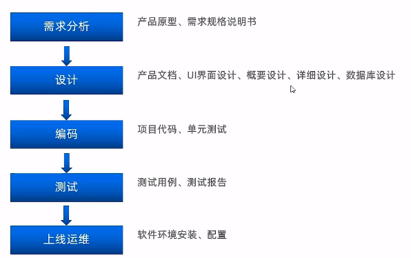
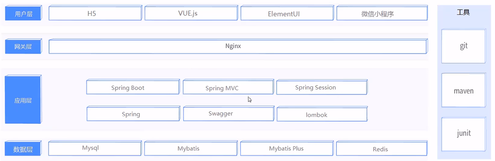
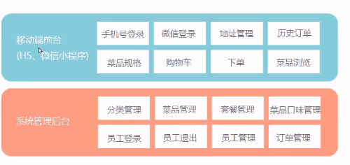
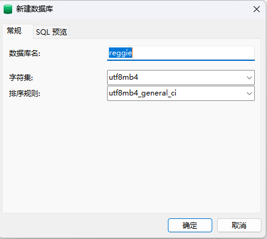
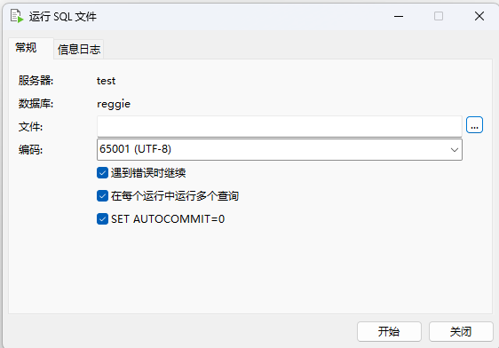
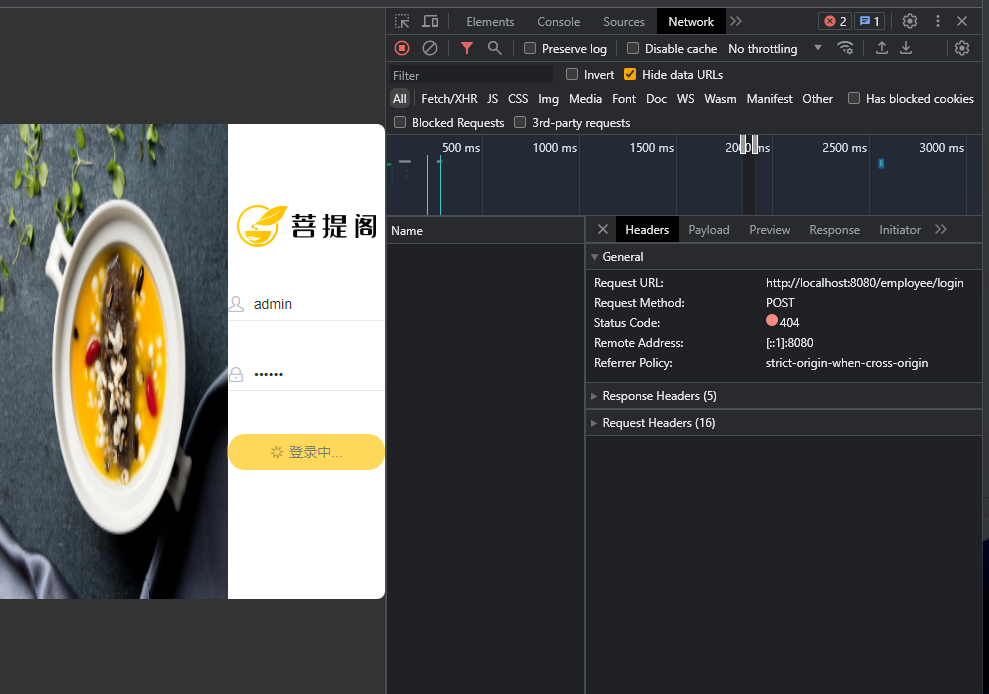
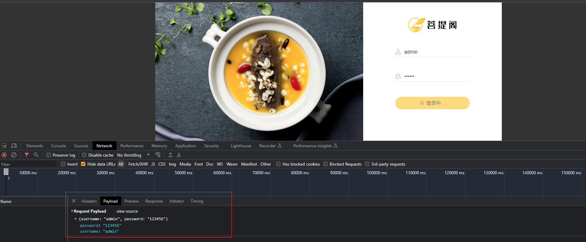
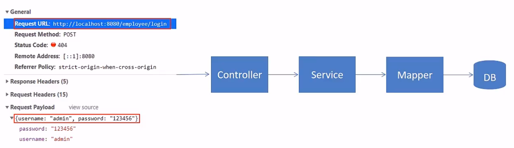

> 本文档主要介绍软件开发整体流程和瑞吉外卖项目，开发环境搭建步骤，以及简单的后台系统功能实现


# 一、软件开发整体介绍

## 1.1软件开发流程

软件一般开发流程如下




## 1.2 角色分工

在软件开发流程中，主要角色有：

- 项目经理:对整个项目负责，任务分配、把控进度
- 产品经理:进行需求调研，输出需求调研文档、产品原型等
- UI设计师:根据产品原型输出界面效果图
- 架构师:项目整体架构设计、技术选型等
- 开发工程师:代码实现
- 测试工程师:编写测试用例，输出测试报告运维工程师:软件环境搭建、项目上线


## 1.3 软件环境

- **开发环境**(development):开发人员在开发阶段使用的环境，一般外部用户无法访问
- **测试环境**(testing):专门给测试人员使用的环境，用于测试项目，一般外部用户无法访问
- **生产环境**(production):即线上环境，正式提供对外服务的环境


# 二、瑞吉外卖项目介绍

## 2.1 项目介绍

本项目（瑞吉外卖）是专门为餐饮企业（餐厅、饭店）定制的一款软件产品，包括系统管理后台和移动端应用两部分。其中**系统管理后台**主要提供给餐饮企业内部员工使用，可以对餐厅的菜品、套餐、订单等进行管理维护。**移动端应用**主要提供给消费者使用，可以在线浏览菜品、添加购物车、下单等。

本项目共分为3期进行开发:

- 第一期主要实现基本需求，其中移动端应用通过H5实现，用户 可以通过手机浏览器访问。
- 第二期主要针对移动端应用进行改进，使用微信小程序实现，用户使用起来更加方便。
- 第三期主要针对系统进行优化升级，提高系统的访问性能。


## 2.2 产品原型展示

产品原型，就是一款产品成型之前的一个简单的框架，就是将页面的排版布局展现出来，使产品的初步构思有一个可视化的展示。通过原型展示，可以更加直观的了解项目的需求和提供的功能。

> 产品原型主要用于展示项目的功能，并不是最终的页面效果


## 2.3 技术选型




## 2.4 功能架构




## 2.5 角色

- 后台系统**管理员**:登录后台管理系统，拥有后台系统中的所有操作权限

- 后台系统**普通员工**:登录后台管理系统，对菜品、套餐、订单等进行管理
- **C端用户**:登录移动端应用，可以浏览菜品、添加购物车、设置地址、在线下单等


# 三、开发环境搭建

## 3.1 创建mysql数据库

利用**navicat**软件创建**reggie**数据库，



或者直接在mysql软件提供的**MySQL 8.0 Command Line Client - Unicode**命名界面里利用sql语句来创建

```
CREATE DATABASE `reggie` CHARACTER SET 'utf8mb4' COLLATE 'utf8mb4_general_ci';
```


## 3.2 导入表结构和数据

运行项目的[sql文件](../sql/)，导入表结构和数据



在数据库中，不同表的具体含义如下：

| 序号 | 表名          | 说明             |
| ---- | ------------- | ---------------- |
| 1    | employee      | 员工表           |
| 2    | category      | 菜品和套餐分类表 |
| 3    | dish          | 菜品表           |
| 4    | setmeal       | 套餐表           |
| 5    | setmeal_dish  | 套餐菜品关系表   |
| 6    | dish_flaver   | 菜品口味关系表   |
| 7    | user          | 用户表(C端）     |
| 8    | address_book  | 地址薄表         |
| 9    | shopping_cart | 购物车表         |
| 10   | orders        | 订单表           |
| 11   | order_detail  | 订单明细表       |


## 3.3 创建maven项目

在InteliJ软件里，创建`reggie_take_out`项目


## 3.4 导入项目配置文件

直接从项目里面复制 **pom.xml** 和 **application.yml** 即可


## 3.5 设置SpringBoot启动类

创建ReggieApplication 文件，设置启动类

```
@Slf4j
@SpringBootApplication
public class ReggieApplication {
    public static void main(String[] args) {
        SpringApplication.run(ReggieApplication.class, args);
        log.info("项目启动成功！！！");
    }
}
```


## 3.6 设置静态资源

将前端资源（**backend**和**front**）直接放在`resourece`目录下。由于静态资源没有放在`template`或者 `static`目录下，必须配置静态资源映射。

> 注意的是，如果设置了静态资源映射，原本默认的`template`或者 `static`目录可能会失效


# 四、后台系统登录功能实现

登录页面为：`reggie_take_out/src/main/resources/backend/page/login/login.html`

## 4.1 需求分析

通过浏览器调试工具(F12)，可以发现，点击登录按钮时，页面会发送请求（请求地址为http://localhost:8080/employee/login）并提交参数(username和password )





此时报404，是因为我们的后台系统还没有响应此请求的处理器，所以我们需要创建相关类来处理登录请求



> 具体代码分析查看视频

