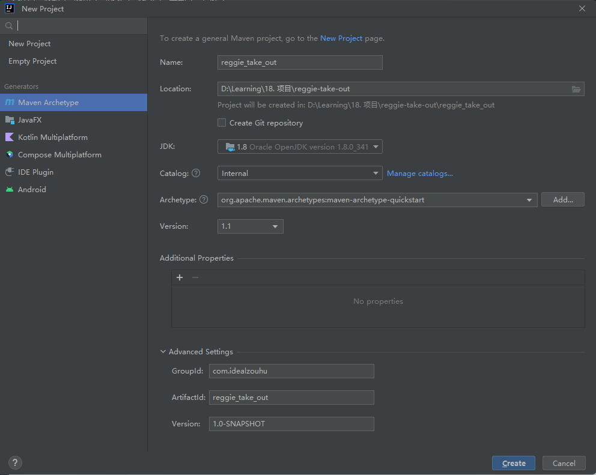

> 本文档主要介绍软件开发整体流程和瑞吉外卖项目，开发环境搭建步骤，以及简单的后台系统功能实现


# 一、软件开发整体介绍

## 1.1软件开发流程

软件一般开发流程如下


## 1.2 角色分工

在软件开发流程中，主要角色有：

- 项目经理:对整个项目负责，任务分配、把控进度
- 产品经理:进行需求调研，输出需求调研文档、产品原型等
- UI设计师:根据产品原型输出界面效果图
- 架构师:  项目整体架构设计、技术选型等
- 开发工程师:代码实现
- 测试工程师:编写测试用例，输出测试报告
- 运维工程师:软件环境搭建、项目上线


## 1.3 软件环境

- **开发环境**(development):开发人员在开发阶段使用的环境，一般外部用户无法访问
- **测试环境**(testing):专门给测试人员使用的环境，用于测试项目，一般外部用户无法访问
- **生产环境**(production):即线上环境，正式提供对外服务的环境


# 二、瑞吉外卖项目介绍

## 2.1 项目介绍

本项目（瑞吉外卖）是专门为餐饮企业（餐厅、饭店）定制的一款软件产品，包括系统管理后台和移动端应用两部分。其中**系统管理后台**主要提供给餐饮企业内部员工使用，可以对餐厅的菜品、套餐、订单等进行管理维护。**移动端应用**主要提供给消费者使用，可以在线浏览菜品、添加购物车、下单等。

本项目共分为3期进行开发:

- 第一期主要实现基本需求，其中移动端应用通过H5实现，用户 可以通过手机浏览器访问。
- 第二期主要针对移动端应用进行改进，使用微信小程序实现，用户使用起来更加方便。
- 第三期主要针对系统进行优化升级，提高系统的访问性能。


## 2.2 产品原型展示

产品原型，就是一款产品成型之前的一个简单的框架，就是将页面的排版布局展现出来，使产品的初步构思有一个可视化的展示。通过原型展示，可以更加直观的了解项目的需求和提供的功能。

> 产品原型主要用于展示项目的功能，并不是最终的页面效果


## 2.3 技术选型


## 2.4 功能架构


## 2.5 角色

- 后台系统**管理员**:登录后台管理系统，拥有后台系统中的所有操作权限

- 后台系统**普通员工**:登录后台管理系统，对菜品、套餐、订单等进行管理
- **C端用户**:登录移动端应用，可以浏览菜品、添加购物车、设置地址、在线下单等


# 三、开发环境搭建

## 3.1 创建mysql数据库

利用**navicat**软件创建**reggie**数据库，


或者直接在mysql软件提供的**MySQL 8.0 Command Line Client - Unicode**命名界面里利用sql语句来创建

```
CREATE DATABASE `reggie` CHARACTER SET 'utf8mb4' COLLATE 'utf8mb4_general_ci';
```


## 3.2 导入表结构和数据

运行项目的[sql文件](../sql/)，导入表结构和数据


在数据库中，不同表的具体含义如下：

| 序号 | 表名          | 说明             |
| ---- | ------------- | ---------------- |
| 1    | employee      | 员工表           |
| 2    | category      | 菜品和套餐分类表 |
| 3    | dish          | 菜品表           |
| 4    | setmeal       | 套餐表           |
| 5    | setmeal_dish  | 套餐菜品关系表   |
| 6    | dish_flaver   | 菜品口味关系表   |
| 7    | user          | 用户表(C端）     |
| 8    | address_book  | 地址薄表         |
| 9    | shopping_cart | 购物车表         |
| 10   | orders        | 订单表           |
| 11   | order_detail  | 订单明细表       |


## 3.3 创建maven项目

在InteliJ软件里，创建`reggie_take_out`项目




## 3.4 导入项目配置文件

直接从项目里面复制 **pom.xml** 和 **application.yml** 即可


## 3.5 设置SpringBoot启动类

创建ReggieApplication 文件，设置启动类

```
@Slf4j
@SpringBootApplication
public class ReggieApplication {
    public static void main(String[] args) {
        SpringApplication.run(ReggieApplication.class, args);
        log.info("项目启动成功！！！");
    }
}
```


## 3.6 设置静态资源

将前端资源（**backend**和**front**）直接放在`resourece`目录下。由于静态资源没有放在`template`或者 `static`目录下，必须配置静态资源映射。

> 注意的是，如果设置了静态资源映射，原本默认的`template`或者 `static`目录可能会失效


# 四、后台系统登录功能实现

登录页面为：`reggie_take_out/src/main/resources/backend/page/login/login.html`

## 4.1 需求分析

通过浏览器调试工具(F12)，可以发现，点击登录按钮时，页面会发送请求（请求地址为 http://localhost:8080/employee/login ）并提交参数( username 和 password )


此时报404，是因为我们的后台系统还没有响应此请求的处理器，所以我们需要创建相关类来处理登录请求


> 具体代码分析查看视频 [业务开发Day1-06-后台系统登录功能_需求分析_哔哩哔哩_bilibili](https://www.bilibili.com/video/BV13a411q753?p=7&vd_source=52cd9a9deff2e511c87ff028e3bb01d2)


## 4.2 登录页面前端代码分析

在`reggie_take_out/src/main/resources/backend/page/login/login.html` 里面， 核心代码如下：

```
methods: {
  async handleLogin() {
    this.$refs.loginForm.validate(async (valid) => {
      if (valid) {
        this.loading = true
        let res = await loginApi(this.loginForm)
        if (String(res.code) === '1') {      // 1 表示登录成功
          localStorage.setItem('userInfo',JSON.stringify(res.data))
          window.location.href= '/backend/index.html'
        } else {
          this.$message.error(res.msg)
          this.loading = false
        }
      }
    })
  }
}
```

code 字段 对应我们创建的结果类 R 里面的 code字段

userInfo 将会是我们存放在 浏览器里面的 Local Storage 的信息


## 4.3 导入结果类

创建 `src/main/java/com/idealzouhu/reggie/common/R.java` ， 服务端响应的所有结果最终都会包装成此种类型返回给前端页面

```
@Data
public class R<T> {

    private Integer code; //编码：1成功，0和其它数字为失败。 

    private String msg; //错误信息

    private T data; //数据

    private Map map = new HashMap(); //动态数据

    public static <T> R<T> success(T object) {
        R<T> r = new R<T>();
        r.data = object;
        r.code = 1;
        return r;
    }

    public static <T> R<T> error(String msg) {
        R r = new R();
        r.msg = msg;
        r.code = 0;
        return r;
    }

    public R<T> add(String key, Object value) {
        this.map.put(key, value);
        return this;
    }

}
```


code 字段 在前端代码里面可以看到


## 4.4 创建登录方法

处理逻辑如下:
1、将页面提交的密码password进行md5加密处理

2、根据页面提交的用户名username查询数据库

3、如果没有查询到则返回登录失败结果
4、密码比对，如果不一致则返回登录失败结果
5、查看员工状态，如果为已禁用状态，则返回员工已禁用结果6、登录成功，将员工id存入Session并返回登录成功结果


代码实现步骤：

- 创建 Employee的 entity 、controller 和 service 层的类
- 在 EmployeeController 类里面创建方法 login()

具体代码为：

```java
 	/**
     * 员工登录
     * @param request
     * @param employee
     * @return
     */
    @PostMapping("/login")
    public R<Employee> login(HttpServletRequest request, @RequestBody Employee employee){
        // 1、将页面提交的密码password进行md5加密处理
        String password = employee.getPassword();
        password = DigestUtils.md5DigestAsHex(password.getBytes());

        // 2、根据页面提交的用户名username查询数据库
        LambdaQueryWrapper<Employee> lambdaQueryWrapper = new LambdaQueryWrapper<>();
        lambdaQueryWrapper.eq(Employee::getUsername, employee.getUsername());
        Employee emp = employeeService.getOne(lambdaQueryWrapper);


        // 3、如果没有查询到则返回登录失败结果
        if(emp == null){
            return R.error("登录失败");
        }

        // 4、密码比对，如果不一致则返回登录失败结果
        if(!emp.getPassword().equals(password)){
            return R.error("登录失败");
        }

        // 5、查看员工状态，如果为已禁用状态，则返回员工已禁用结果
        if(emp.getStatus() == 0){
            return R.error("账号已禁用");
        }

        // 6、登录成功，将员工id存入Session并返回登录成功结果
        request.getSession().setAttribute("employee",emp.getId());
        return R.success(emp);
    }
```


## 4.5 功能分析

点击 http://localhost:8080/backend/page/login/login.html  访问登录页面

当输入错误密码时，后台输出

```
Creating a new SqlSession
SqlSession [org.apache.ibatis.session.defaults.DefaultSqlSession@3776c82] was not registered for synchronization because synchronization is not active
JDBC Connection [com.mysql.cj.jdbc.ConnectionImpl@5531150d] will not be managed by Spring
==>  Preparing: SELECT id,username,name,password,phone,sex,id_number,status,create_time,update_time,create_user,update_user FROM employee WHERE (username = ?)
==> Parameters: admin(String)
<==    Columns: id, username, name, password, phone, sex, id_number, status, create_time, update_time, create_user, update_user
<==        Row: 1, admin, 管理员, e10adc3949ba59abbe56e057f20f883e, 13812312312, 1, 110101199001010047, 1, 2021-05-06 17:20:07, 2021-05-10 02:24:09, 1, 1
<==      Total: 1
Closing non transactional SqlSession [org.apache.ibatis.session.defaults.DefaultSqlSession@3776c82]
```

当输入正确密码时，后台输出

```
Creating a new SqlSession
SqlSession [org.apache.ibatis.session.defaults.DefaultSqlSession@5903fc44] was not registered for synchronization because synchronization is not active
2024-01-11 00:26:43.126 ERROR 28860 --- [nio-8080-exec-1] c.a.druid.pool.DruidAbstractDataSource   : discard long time none received connection. , jdbcUrl : jdbc:mysql://localhost:3306/reggie?serverTimezone=Asia/Shanghai&useUnicode=true&characterEncoding=utf-8&zeroDateTimeBehavior=convertToNull&useSSL=false&allowPublicKeyRetrieval=true, jdbcUrl : jdbc:mysql://localhost:3306/reggie?serverTimezone=Asia/Shanghai&useUnicode=true&characterEncoding=utf-8&zeroDateTimeBehavior=convertToNull&useSSL=false&allowPublicKeyRetrieval=true, lastPacketReceivedIdleMillis : 135302
JDBC Connection [com.mysql.cj.jdbc.ConnectionImpl@6617c204] will not be managed by Spring
==>  Preparing: SELECT id,username,name,password,phone,sex,id_number,status,create_time,update_time,create_user,update_user FROM employee WHERE (username = ?)
==> Parameters: admin(String)
<==    Columns: id, username, name, password, phone, sex, id_number, status, create_time, update_time, create_user, update_user
<==        Row: 1, admin, 管理员, e10adc3949ba59abbe56e057f20f883e, 13812312312, 1, 110101199001010047, 1, 2021-05-06 17:20:07, 2021-05-10 02:24:09, 1, 1
<==      Total: 1
Closing non transactional SqlSession [org.apache.ibatis.session.defaults.DefaultSqlSession@5903fc44]
```


# 五、后台退出功能

## 5.1 需求分析

员工登录后，页面跳转到后台系统首页界面( backend/index.html )

如果员工需要退出系统，直接点击右侧的退出按钮即可退出系统


## 5.2 前端代码分析

backend/index.html 页面，登录退出的前端代码为：

```

.........              
logout() {
            logoutApi().then((res)=>{
              if(res.code === 1){
                localStorage.removeItem('userInfo')
                window.location.href = '/backend/page/login/login.html'
              }
            })
          },    
```

logoutApi()  在 login.js 里面

```
function logoutApi(){
  return $axios({
    'url': '/employee/logout',
    'method': 'post',
  })
}
```


## 5.3 退出功能实现

处理逻辑为：

1. 清除 session中的 保存的当前登录员工的id。 （即从当前用户的会话（session）中移除名为 "employee" 的属性。）
2. 输出结果

代码实现：

在 EmployeeController 类里面创建方法 logout()  ,  具体代码为：

```java
/**
* 员工退出
* @param request
* @return
*/
@PostMapping("/logout")
public R<String> logout(HttpServletRequest request){
    // 清楚Session中的 保存的当前登录员工的id
    request.getSession().removeAttribute("employee");
    return R.success("退出成功");
}
```


# 参考资料

[idealzouhu/reggie-take-out: 瑞吉外卖项目, 利用SpringBoot + SSM技术栈实现 (github.com)](https://github.com/idealzouhu/reggie-take-out)

[黑马程序员Java项目实战《瑞吉外卖》bilibili](https://www.bilibili.com/video/BV13a411q753/?spm_id_from=333.337.search-card.all.click&vd_source=52cd9a9deff2e511c87ff028e3bb01d2)

