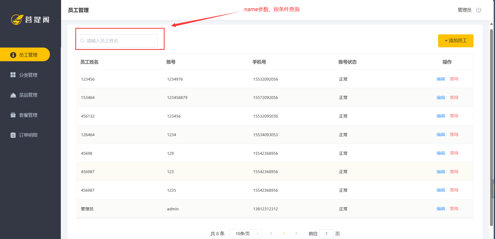

> 本文档主要 完善员工的后台系统登录功能，新增员工，员工信息分页查询，启用/禁用员工账号，编辑员工信息


# 一、完善后台系统登录功能

## 1.1 问题分析

目前存在的问题是：理论上，用户必须在 http://localhost:8080/backend/page/login/login.html  登录，才能访问系统首页。但是，现在用户如果不登录，依然可以访问系统的首页 http://localhost:8080/backend/index.html


## 1.2 解决方案

针对该问题，解决方案主要有：使用过滤器或者拦截器，在过滤器或者拦截器中判断用户是否已经完成登录，如果没有则跳转到登录页面。

本项目选择过滤器这一解决方案 ， 实现步骤为：

1. 创建自定义过滤器 LoginCheckfilter
2. 在启动类上加入注解 @ServletComponentScan
3. 完善过滤器实现逻辑

过滤器具体的处理逻辑如下：

1. 获取本次请求的URI
2. 判断本次请求是否需要处理
3. 如果不需要处理，则直接放行
4. 判断登录状态，如果已登录，则直接放行
5. 如果未登录则返回未登录结果


## 1.3 前端代码分析

在 `src/main/resources/backend/js/request.js` 文件，前端响应拦截器的代码如下：

```
 // 响应拦截器
  service.interceptors.response.use(res => {
      if (res.data.code === 0 && res.data.msg === 'NOTLOGIN') {// 返回登录页面
        console.log('---/backend/page/login/login.html---')
        localStorage.removeItem('userInfo')
        window.top.location.href = '/backend/page/login/login.html'
      } else {
        return res.data
      }
    }
```

`NOTLOGIN`  字符串将会用于 后端的拦截器的实现。


## 1.4 代码实现

新建 java 类 `src/main/java/com/idealzouhu/reggie/filter/LoginCheckFilter.java`， 具体代码如下：

```
package com.idealzouhu.reggie.filter;

import com.alibaba.fastjson.JSON;
import com.idealzouhu.reggie.common.R;
import lombok.extern.slf4j.Slf4j;
import org.springframework.util.AntPathMatcher;

import javax.servlet.*;
import javax.servlet.annotation.WebFilter;
import javax.servlet.http.HttpServletRequest;
import javax.servlet.http.HttpServletResponse;
import java.io.IOException;

/**
 * 检查用户是否已经完成了登录
 */
@Slf4j
@WebFilter(filterName = "loginCheckFilter", urlPatterns = "/*")
public class LoginCheckFilter implements Filter {
    // 路径匹配器，支持通配符
    public static final AntPathMatcher PATH_MATCHER = new AntPathMatcher();

    /**
     * 路径匹配，检测本次请求是否需要放行
     * @param urls
     * @param requestURI
     * @return
     */
    public boolean check(String[] urls, String requestURI){
        for( String url : urls){
            boolean match = PATH_MATCHER.match(url, requestURI);
            if(match){
                return true;
            }
        }
        return false;
    }

    @Override
    public void doFilter(ServletRequest servletRequest, ServletResponse servletResponse, FilterChain filterChain) throws IOException, ServletException {
        HttpServletRequest request = (HttpServletRequest) servletRequest;
        HttpServletResponse response = (HttpServletResponse) servletResponse;

        // 1. 获取本次请求的URI
        String requestURI = request.getRequestURI();
        log.info("拦截到请求： {}",request.getRequestURI());

        // 2. 判断本次请求是否需要处理
        String[] urls = new String[]{        // 定义不需要处理的请求路径;
                "/employee/login",
                "/emplyee/logout",
                "/backend/**",
                "/front/**"
        };
        boolean check = check(urls, requestURI);

        // 3. 如果不需要处理，则直接放行
        if(check){
            log.info("本次请求  {} 不需要处理",request.getRequestURI());
            filterChain.doFilter(request, response);
            return;
        }

        // 4. 判断登录状态，如果已登录，则直接放行
        if(request.getSession().getAttribute("employee") != null){
            log.info("用户已登录，id为：  {} ",request.getSession().getAttribute("employee"));
            filterChain.doFilter(request, response);
            return；
        }

        // 5. 如果未登录则返回未登录结果. 通过输出流方式向客户端页面响应数据
        log.info("用户未登录");
        response.getWriter().write(JSON.toJSONString(R.error("NOTLOGIN")));
        return;
    }
}

```

注意，官方视频在这里少打了一个 return ，导致登录用户存放在session里面会被删掉（即误执行`response.getWriter().write(JSON.toJSONString(R.error("NOTLOGIN")))` ，间接执行前端代码`localStorage.removeItem('userInfo')` ）。


## 1.5 功能测试

直接访问 http://localhost:8080/backend/index.html ， 看页面是否会跳转到登录页面


# 二、新增员工

## 2.1 需求分析

在后台管理系统中， 通过新增员工来添加后台系统用户。


## 2.2 数据模型

本质上，将新增的员工数据新增到 employee 表里面


需要注意，employee 表中对 `username` 字段加入了唯一约束。因为 `username` 是员工的登录账号，具备唯一性。


## 2.3 前端代码分析

员工列表页面为 `src/main/resources/backend/page/member/list.html`， 

```html
 <el-button
          type="primary"
          @click="addMemberHandle('add')"
        >
          + 添加员工
</el-button>

..........

 // 添加
          addMemberHandle (st) {
            if (st === 'add'){
              window.parent.menuHandle({
                id: '2',
                url: '/backend/page/member/add.html',
                name: '添加员工'
              },true)
            } else {
              window.parent.menuHandle({
                id: '2',
                url: '/backend/page/member/add.html?id='+st,
                name: '修改员工'
              },true)
            }
          }
```

menuHandle方法的实现在 `src/main/resources/backend/index.html` 里面，

```
mounted() {
  window.menuHandle = this.menuHandle
},

 menuHandle(item, goBackFlag) {
            this.loading = true
            this.menuActived = item.id
            this.iframeUrl = item.url
            this.headTitle = item.name
            this.goBackFlag = goBackFlag
            this.closeLoading()
          }
```


最后，在添加员工的页面  `src/main/resources/backend/page/member/add.html`，点击保存按钮， 会触发 `addEmployee()` 方法

```
 submitForm (formName, st) {
            this.$refs[formName].validate((valid) => {
              if (valid) {
                if (this.actionType === 'add') {
                  const params = {
                    ...this.ruleForm,
                    sex: this.ruleForm.sex === '女' ? '0' : '1'
                  }
                  addEmployee(params).then(res => {
                    if (res.code === 1) {
                      this.$message.success('员工添加成功！')
                      if (!st) {
                        this.goBack()
                      } else {
                        this.ruleForm = {
                          username: '',
                          'name': '',
                          'phone': '',
                          // 'password': '',
                          // 'rePassword': '',/
                          'sex': '男',
                          'idNumber': ''
                        }
                      }
```

`addEmployee()` 方法的实现代码在 `backend/api/member.js` 里面

```
// 新增---添加员工
function addEmployee (params) {
  return $axios({
    url: '/employee',
    method: 'post',
    data: { ...params }
  })
}
```

需要注意，我将 url 改成  '/employee/addEmployee'


前端代码较为复杂，建议观看原视频[业务开发Day2-06-新增员工_梳理程序执行流程_哔哩哔哩_bilibili](https://www.bilibili.com/video/BV13a411q753?p=20&vd_source=52cd9a9deff2e511c87ff028e3bb01d2)


## 2.4 代码开发

在开发代码之前，需要梳理一下整个程序的执行过程:

1. 页面发送ajax请求，将新增员工页面中输入的数据以json的形式提交到服务端
2. 服务端Contraller接收页面提交的数据并调用Service将数据进行保存
3. Service调用Mapper操作数据库，保存数据


在 employee 里面新建方法 ，

```
  /**
     * 新增员工
     * @param employee
     * @return
     */
    @PostMapping("/addemployee")
    public R<String> addEmployee(HttpServletRequest request,@RequestBody Employee employee){
        log.info("新增员工， 员工信息：{}", employee.toString());

        // 设置初始密码 123456， 需要进行MD5 加密处理
        employee.setPassword(DigestUtils.md5DigestAsHex("123456".getBytes()));

        employee.setCreateTime(LocalDateTime.now());
        employee.setUpdateTime(LocalDateTime.now());

        // 获得当前登录用户的id
        Long empID = (Long) request.getSession().getAttribute("employee");
        employee.setCreateUser(empID);
        employee.setUpdateUser(empID);

        employeeService.save(employee);

        return R.success("新增员工成功");
//        return null;  // 如果返回 null 值，会导致前端页面莫名其妙跳转到 登录页面，并删除登录信息
    }
```


## 2.5 功能测试

输入员工信息，点击 “保存”


在数据库里面，也可以看到相应的信息


另外，如果我们再次新增用户名为 1235 的用户，后台会报错

```
java.sql.SQLIntegrityConstraintViolationException: Duplicate entry '1235' for key 'employee.idx_username'
```

这是因为  `username` 是员工的登录账号，具备唯一性。


## 2.6 代码修复

前面的程序还存在一个问题：当新增员工的账号已经存在时，由于 `username` 具备唯一性，程序会抛出异常

```
java.sql.SQLIntegrityConstraintViolationException: Duplicate entry '1235' for key 'employee.idx_username'
```

此时需要我们进行异常捕获，通常有两种处理方式：

1. 在Controller 方法中加入 try、catch 进行异常捕获
2. 使用异常处理器进行全局异常捕获 （本文采用这种方式）

创建 `src/main/java/com/idealzouhu/reggie/common/GlobalExceptionHandler.java`， 实现代码为：

```
package com.idealzouhu.reggie.common;

import lombok.extern.slf4j.Slf4j;
import org.springframework.stereotype.Controller;
import org.springframework.web.bind.annotation.ControllerAdvice;
import org.springframework.web.bind.annotation.ExceptionHandler;
import org.springframework.web.bind.annotation.ResponseBody;
import org.springframework.web.bind.annotation.RestController;

import java.sql.SQLIntegrityConstraintViolationException;

/**
 * 全局异常处理
 */
@Slf4j
@ControllerAdvice(annotations = {RestController.class, Controller.class})
@ResponseBody
public class GlobalExceptionHandler {

    /**
     * 处理新增员工账号已经存在时抛出的异常
     * @return
     */
    @ExceptionHandler(SQLIntegrityConstraintViolationException.class)
    public R<String> exceptionHandler(SQLIntegrityConstraintViolationException ex){
        log.error(ex.getMessage());

        if(ex.getMessage().contains("Duplicate entry")){
            String[] split = ex.getMessage().split(" ");
            String msg = split[2] + "已存在";
            return R.error(msg);
        }

        return R.error("未知错误");
    }

}

```


## 2.7 总结

1. 根据产品原型明确业务需求
2. 重点分析数据的流转过程和数据格式
3. 通过debug断点调试跟踪程序执行过程


# 三、员工信息分页查询

## 3.1 需求分析

当员工数量较多时，我们需要分页查询员工信息，便于查看。

同时，我们还可以根据员工姓名查询，即**按条件分页查询**。



其中，参数主要有 page、pagesize，name。name是我们按条件分页查询的条件


## 3.2 前端代码分析

(1) List.html

员工列表页面为 `src/main/resources/backend/page/member/list.html`， 

```
<el-pagination
        class="pageList"
        :page-sizes="[10, 20, 30, 40]"   
        :page-size="pageSize"
        layout="total, sizes, prev, pager, next, jumper"
        :total="counts"
        :current-page.sync="page"
        @size-change="handleSizeChange"
        @current-change="handleCurrentChange"
      ></el-pagination>

...................

data() {
          return {
             input: '',
             counts: 0,
             page: 1,         // 分页查询的默认值
             pageSize: 10,
             tableData : [],
             id : '',
             status : '',
          }
        }
 
 .....................
 
created() {
          this.init()
          this.user = JSON.parse(localStorage.getItem('userInfo')).username
        }
 
 .......
 
   async init () {
            const params = {
              page: this.page,
              pageSize: this.pageSize,
              name: this.input ? this.input : undefined
            }
            await getMemberList(params).then(res => {
              if (String(res.code) === '1') {
                this.tableData = res.data.records || []
                this.counts = res.data.total
              }
            }).catch(err => {
              this.$message.error('请求出错了：' + err)
            })
          },
          handleQuery() {
            this.page = 1;
            this.init();
          }
```

这部分代码展示了 为什么员工信息查询会每次自动请求。

`:page-sizes="[10, 20, 30, 40]"`  ：  对应 分页查询里面的下拉条， 即每页显示多少页。

`pageSize: 10`： 表示默认值，即每页显示 10 页


（2）getMemberList()

`getMemberList()` 方法的实现代码在 `backend/api/member.js` 里面

```
function getMemberList (params) {
  return $axios({
    url: '/employee/page',
    method: 'get',
    params
  })
}
```

(3) request.js

我们会发现一个问题：在list.html， page 和pagesize 参数是 json 格式。但是，在URI里面，参数并不是 json 格式，而是 `http://localhost:8080/employee/page?page=1&pageSize=10`。

在 src/main/resources/backend/js/request.js ， request拦截器将参数重新组装，放在 URI 的后面

```
  // request拦截器
  service.interceptors.request.use(config => {
    // get请求映射params参数
    if (config.method === 'get' && config.params) {
      let url = config.url + '?';
      for (const propName of Object.keys(config.params)) {
        const value = config.params[propName];
        var part = encodeURIComponent(propName) + "=";
        if (value !== null && typeof(value) !== "undefined") {
          if (typeof value === 'object') {
            for (const key of Object.keys(value)) {
              let params = propName + '[' + key + ']';
              var subPart = encodeURIComponent(params) + "=";
              url += subPart + encodeURIComponent(value[key]) + "&";
            }
          } else {
            url += part + encodeURIComponent(value) + "&";
          }
        }
      }
```


## 3.3 代码开发

在开发代码之前，需要梳理一下整个程序的执行过程:

1. 页面发送ajax请求，将分页查询参数(page、pageSize、name)提交到服务端
2. 服务端Controller接收页面提交的数据并调用Service查询数据
3. Service调用Mapper操作数据库，查询分页数据
4. Controller将查询到的分页数据响应给页面
5. 页面接收到分页数据并通过ElementUI的Table组件展示到页面上

为了更好地实现分页查询，我们使用MP提供的分页查询：

（1）配置 MP 分页插件

创建`src/main/java/com/idealzouhu/reggie/config/MybatisPlusConfig.java`

```
package com.idealzouhu.reggie.config;

import com.baomidou.mybatisplus.extension.plugins.MybatisPlusInterceptor;
import com.baomidou.mybatisplus.extension.plugins.inner.PaginationInnerInterceptor;
import org.springframework.context.annotation.Bean;
import org.springframework.context.annotation.Configuration;

/**
 * 配置 MP 的分页插件
 */
@Configuration
public class MybatisPlusConfig {

    @Bean
    public MybatisPlusInterceptor mybatisPlusInterceptor(){
        MybatisPlusInterceptor mybatisPlusInterceptor = new MybatisPlusInterceptor();
        mybatisPlusInterceptor.addInnerInterceptor(new PaginationInnerInterceptor());
        return mybatisPlusInterceptor;
    }

}
```

（2）创建 controller 方法

在`src/main/java/com/idealzouhu/reggie/controller/EmployeeController.java`类里面，新建方法

```
 @GetMapping("/page")
    public R<Page> page(int page, int pageSize, String name){
        log.info("page = {}, pageSize = {}, name={} ", page, pageSize,name);

        // 1. 构造分页查询器
        Page pageInfo = new Page(page, pageSize);

        // 2. 构造条件构造器
        LambdaQueryWrapper<Employee> lambdaQueryWrapper = new LambdaQueryWrapper();
        lambdaQueryWrapper.like(StringUtils.isNotEmpty(name), Employee::getName, name); // 添加过滤条件
        lambdaQueryWrapper.orderByDesc(Employee::getUpdateTime);  // 添加排序条件

        // 3.执行查询
        employeeService.page(pageInfo, lambdaQueryWrapper);

        return R.success(pageInfo);
    }
```


## 3.4 功能测试

直接查看员工信息分页是否正常


# 四、启用/禁用员工账号

## 4.1 需求分析

在员工管理列表页面，可以对某个员工账号进行启用或者禁用操作。账号禁用的员工不能登录系统，启用后的员工可以正常登录。

需要注意的是，只有管理员 admin 具备权限，可以对所用员工账号进行启用、禁用操作。所以普通用户登录系统后启用、禁用按钮不显示。

如果某个员工账号状态为正常，则按钮显示为 `禁用`；如果员工账号状态为已禁用， 则按钮显示为 ”启用“。


## 4.2 前端代码分析

(1) List.html

在员工列表页面 `src/main/resources/backend/page/member/list.html`， 

```javascript
<el-button
              type="text"
              size="small"
              class="delBut non"
              @click="statusHandle(scope.row)"
              v-if="user === 'admin'"
            >
              {{ scope.row.status == '1' ? '禁用' : '启用' }}
            </el-button>
..........

created() {
          this.init()
          // 获取当前登录员工的账号，并赋值给模型数据
          this.user = JSON.parse(localStorage.getItem('userInfo')).username
        }
        
.................
//状态修改
          statusHandle (row) {
            this.id = row.id
            this.status = row.status
            this.$confirm('确认调整该账号的状态?', '提示', {
              'confirmButtonText': '确定',
              'cancelButtonText': '取消',
              'type': 'warning'
              }).then(() => {
              enableOrDisableEmployee({ 'id': this.id, 'status': !this.status ? 1 : 0 }).then(res => {
                console.log('enableOrDisableEmployee',res)
                if (String(res.code) === '1') {
                  this.$message.success('账号状态更改成功！')
                  this.handleQuery()
                }
              }).catch(err => {
                this.$message.error('请求出错了：' + err)
              })
            })
          }
```

`{{ scope.row.status == '1' ? '禁用' : '启用' }}`： 如果员工账号状态scope.row.status为正常（即1），则按钮显示为 `禁用`；如果员工账号状态为已禁用， 则按钮显示为 `启用`

`v-if="user === 'admin'"`: 如果登录用户是管理员，则看到 `禁用` 、`启用`按钮。否则的话，则不显示。

`statusHandle()`: 修改员工状态的 核心函数


（2）enableOrDisableEmployee()

`enableOrDisableEmployee()` 方法的实现代码在 `backend/api/member.js` 里面

```
// 修改---启用禁用接口
function enableOrDisableEmployee (params) {
  return $axios({
    url: '/employee',
    method: 'put',
    data: { ...params }
  })
}
```


## 4.2 代码开发

在开发代码之前，需要梳理一下整个程序的执行过程:

1. 页面发送ajax请求，将参数(id、status)提交到服务端
2. 服务端Controller接收页面提交的数据并调用Service更新数据
3. Service调用Mapper操作数据库

本质上，这段代码的作用是更改员工的 `status` 字段。


## 4.3 代码修复

**问题：**”禁用/启用“功能可以运行，但是数据库里面 status 状态并没有更新

**原因：**前端返回过来的json数据里面，员工 id 和其实际 id 不一样。 <font color="red">**js 对 long 型数据进行处理时丢失精度**</font>，导致提交的 id 和 数据库中的id 不一致。

**解决方案：**在服务端给页面响应 json 数据时进行处理，将 long 型数据统一转为 String 字符串

**具体实现步骤：**

1. 提供 对象转换器 JacksonObject ， 基于 JackSon 进行 Java 对象到json数据的转换。 创建 `src/main/java/com/idealzouhu/reggie/common/JacksonObjectMapper.java` ， 相应代码如下

   ```
   /**
    * 对象映射器:基于jackson将Java对象转为json，或者将json转为Java对象
    * 将JSON解析为Java对象的过程称为 [从JSON反序列化Java对象]
    * 从Java对象生成JSON的过程称为 [序列化Java对象到JSON]
    */
   public class JacksonObjectMapper extends ObjectMapper {
   
       public static final String DEFAULT_DATE_FORMAT = "yyyy-MM-dd";
       public static final String DEFAULT_DATE_TIME_FORMAT = "yyyy-MM-dd HH:mm:ss";
       public static final String DEFAULT_TIME_FORMAT = "HH:mm:ss";
   
       public JacksonObjectMapper() {
           super();
           //收到未知属性时不报异常
           this.configure(FAIL_ON_UNKNOWN_PROPERTIES, false);
   
           //反序列化时，属性不存在的兼容处理
           this.getDeserializationConfig().withoutFeatures(DeserializationFeature.FAIL_ON_UNKNOWN_PROPERTIES);
   
   
           SimpleModule simpleModule = new SimpleModule()
                   .addDeserializer(LocalDateTime.class, new LocalDateTimeDeserializer(DateTimeFormatter.ofPattern(DEFAULT_DATE_TIME_FORMAT)))
                   .addDeserializer(LocalDate.class, new LocalDateDeserializer(DateTimeFormatter.ofPattern(DEFAULT_DATE_FORMAT)))
                   .addDeserializer(LocalTime.class, new LocalTimeDeserializer(DateTimeFormatter.ofPattern(DEFAULT_TIME_FORMAT)))
   
                   .addSerializer(BigInteger.class, ToStringSerializer.instance)
                   .addSerializer(Long.class, ToStringSerializer.instance)
                   .addSerializer(LocalDateTime.class, new LocalDateTimeSerializer(DateTimeFormatter.ofPattern(DEFAULT_DATE_TIME_FORMAT)))
                   .addSerializer(LocalDate.class, new LocalDateSerializer(DateTimeFormatter.ofPattern(DEFAULT_DATE_FORMAT)))
                   .addSerializer(LocalTime.class, new LocalTimeSerializer(DateTimeFormatter.ofPattern(DEFAULT_TIME_FORMAT)));
   
           //注册功能模块 例如，可以添加自定义序列化器和反序列化器
           this.registerModule(simpleModule);
       }
   }
   ```

   

2. 在 WebMvcConfig 配置类中扩展 Spring MVC 的消息转换器，在此消息转换器中使用提供对象转换器进行 Java 对象到 json 数据的转换。如果不扩展的话，那么项目会使用 Spring MVC 所使用的默认配置器。

   ```
   /**
        * 扩展 MVC 框架的消息转换器
     * @param converters
        */
    @Override
       public void extendMessageConverters(List<HttpMessageConverter<?>> converters) {
           log.info("扩展消息转换器");
   
           // 创建消息转换器对象
           MappingJackson2HttpMessageConverter messageConverter = new MappingJackson2HttpMessageConverter();
   
           // 设置对象转换器， 底层使用 Jackson 将对象转为 json
           messageConverter.setObjectMapper(new JacksonObjectMapper());
   
           // 将上面的消息转换器对象追加到 MVC 框架的转换器集合中
           converters.add(0, messageConverter);
   
   //        WebMvcConfigurer.super.extendMessageConverters(converters);
       }
   ```
   
   我们可以通过调试来观察消息转换器是否添加成功
   
   


我们再次运行启用/禁用 功能，可以很明显观察到 json 对象的变化


# 五、编辑员工账号

## 5.1 需求分析

在员工管理页面点击编辑按钮在员工管理列表页面点击编辑按钮，跳转到编辑页面，在编辑页面回显员工信息并进行修改，最后点击保存按钮完成编辑操作。

对于编辑员工，如果员工不存在，则是 新增员工。如果员工已存在，则是 编辑员工。因此，对于后端而言，编辑员工和新增员工的代码基本上类似。


## 5.2 前端代码分析

(1) add.html 

注意: add.html 页面为公共页面，新增员工和编辑员工都是在此页面操作

在 `src/main/resources/backend/page/member/add.html` 里面，

```
created() {
  this.id = requestUrlParam('id')
  this.actionType = this.id ? 'edit' : 'add'
  if (this.id) {
    this.init()
  }
}
......
async init () {
            queryEmployeeById(this.id).then(res => {
              console.log(res)
              if (String(res.code) === '1') {
                console.log(res.data)
                this.ruleForm = res.data
                this.ruleForm.sex = res.data.sex === '0' ? '女' : '男'
                // this.ruleForm.password = ''
              } else {
                this.$message.error(res.msg || '操作失败')
              }
            })
          }
```

`this.actionType = this.id ? 'edit' : 'add'`： id 有值的话，就是编辑员工。否则新增员工

（2）requestUrlParam()

在 `src/main/resources/backend/js/index.js` 里，requestUrlParam() 解析 url地址上面的参数。举个例子，`http://localhost:8080/backend/page/member/add.html?id=1745800121368453122`，该函数会将 id 参数动态提取出来。

```
//获取url地址上面的参数
function requestUrlParam(argname){
  var url = location.href
//  alert(url)
  var arrStr = url.substring(url.indexOf("?")+1).split("&")
  for(var i =0;i<arrStr.length;i++)
  {
      var loc = arrStr[i].indexOf(argname+"=")
      if(loc!=-1){
          return arrStr[i].replace(argname+"=","").replace("?","")
      }
  }
  return ""
}
```

（3） queryEmployeeById()

在 `src/main/resources/backend/api/member.js`里， queryEmployeeById() 根据员工 id 查询员工信息

```
// 修改页面反查详情接口
function queryEmployeeById (id) {
  return $axios({
    url: `/employee/${id}`,
    method: 'get'
  })
}
```


## 5.2 代码开发

在开发代码之前需要梳理一下操作过程和对应的程序的执行流程:

1. 点击编辑按钮时，页面跳转到 add.html，并在 url 中携带参数[员工id]  （例如 `http://localhost:8080/backend/page/member/add.html?id=1745800121368453122`）
2. 在 add.html 页面获取 url中的参数[员工id]
3. 发送 ajax 请求，请求服务端，同时提交员工 id 参数
4. 服务端接收请求，**根据员工 id 查询员工信息**，将员工信息以json形式响应给页面
5. 页面接收服务端响应的json数据，通过VUE的数据绑定进行员工信息回显
6. 点击保存按钮，发送ajax请求，将页面中的员工信息以json方式提交给服务端
7. 服务端**接收员工信息，并进行处理**，完成后给页面响应
8. 页面接收到服务端响应信息后进行相应处理
   


在 `src/main/java/com/idealzouhu/reggie/controller/EmployeeController.java` 里面， 添加以下代码：

```
/**
     * 根据id 编辑员工 （事实上，这段代码与下面的功能”启用/禁用员工“一样）
     * @param employee
     * @return
     */
    @PutMapping("/editEmployee")
    public R<String> editEmployee(HttpServletRequest request, @RequestBody Employee employee){
        log.info(employee.toString());

        Long empID = (Long)request.getSession().getAttribute("employee");
        employee.setUpdateUser(empID);
        employee.setUpdateTime(LocalDateTime.now());
        employeeService.updateById(employee);

        return R.success("员工信息修改成功");
    }

/**
     * 根据员工 id 查询信息
     * @param id
     * @return
     */
    @GetMapping("/{id}")
    public R<Employee> getById(@PathVariable Long id){
        log.info("根据员工id（{}）查询信息：", id);
        Employee employee = employeeService.getById(id);
        if(employee != null){
            return R.success(employee);
        }
        return R.error("没有查询到对应员工信息");
    }
```

