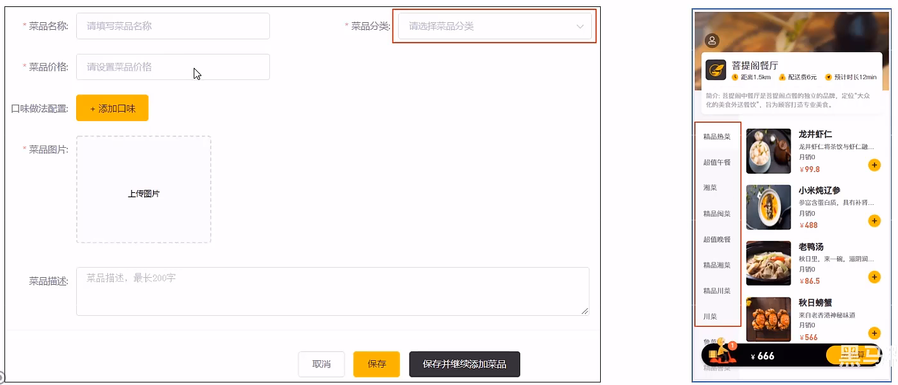

> 本文档主要实现分类管理业务，包括 公共字段自动填充，新增分类，分类信息分页查询，删除分类，修改分类


# 一、公共字段自动填充

## 1.1 问题分析

前面我们已经完成了员工信息管理。但是，我们在新增员工时需要设置创建时间、创建人、修改时间、修改人等字段，在编辑员工时需要设置修改时间和修改人等字段。这些字段属于公共字段。

能不能对于这些公共字段在某个地方统一处理，来简化开发？我们可以使用 Mybatis-Plus 提供的<font color="red">**公共字段自动填充**</font>功能

Mybatis Plus公共字段自动填充，也就是在插入或者更新的时候为指定字段赋予指定的值，使用它的好处就是可以统一对这些字段进行处理，避免了重复代码。

## 1.2 代码实现

**（1）公共字段自动填充**

公共字段自动填充实现步骤:

1. 在实体类的属性上加入@TableField注解，指定自动填充的策略。对于 `src/main/java/com/idealzouhu/reggie/entity/Employee.java`， 更新代码

   ```java
   @TableField(fill = FieldFill.INSERT)  // 插入时填充字段
   private LocalDateTime createTime;
   
   @TableField(fill = FieldFill.INSERT_UPDATE) //  插入和更新时填充字段
   private LocalDateTime updateTime;
   
   @TableField(fill = FieldFill.INSERT)
   private Long createUser;
   
   @TableField(fill = FieldFill.INSERT_UPDATE)
   private Long updateUser;
   ```

2. 按照框架要求编写**元数据对象处理器**，在此类中统一为公共字段赋值，此类需要实现 MetaObjectHandler 接口。创建 `src/main/java/com/idealzouhu/reggie/common/MyMetaObjectHandler.java`

   ```java
   /**
    * 自定义元数据对象处理器
    */
   @Component
   @Slf4j
   public class MyMetaObjectHandler implements MetaObjectHandler {
       @Override
       public void insertFill(MetaObject metaObject) {
           metaObject.setValue("createTime", LocalDateTime.now());  // createTime 为 Employee 实体里面的属性
           metaObject.setValue("updateTime", LocalDateTime.now());
           metaObject.setValue("createUser", new Long(1));    // 暂时强制赋值
           metaObject.setValue("updateUser", new Long(1));
       }
   
       @Override
       public void updateFill(MetaObject metaObject) {
           metaObject.setValue("updateTime", LocalDateTime.now());
           metaObject.setValue("updateUser", new Long(1));
       }
   }
   ```
   
   这里有一个问题：在自动填充时，我们需要动态获取当前登录用户的 id。
   

但是，在 MyMetaObjectHandler 类中，我们是不能获取登录用户的 id。我们可以**使用 TreadLocal 类 来解决这个问题**。ThreadLocal为每个线程提供单独一份存储空间，具有线程隔离的效果，只有在线程内才能获取到对应的值，线程外则不能访问。

## 1.3 功能完善

现在，我们要使用 TreadLocal 类动态获取用户 id

在学习ThreadLocal之前，我们需要先确认一个事情，就是 <font color="red">**客户端发送的每次 http 请求，对应的在服务端都会分配一个新的线程来处理**</font>，在处理过程中涉及到下面类中的方法都属于相同的一个线程:
   1、LoginCheckFilter  的  doFilter 方法
   2、 EmployeeController的 editEmployee 方法
  3、MyMetaObjectHandler的 updateFill 方法
   可以在上面的三个方法中分别加入下面代码（获取当前线程id) :

   ```java
log.info("线程id: {}" , Thread.currentThread().getId()) ;
   ```

   执行编辑员工功能进行验证，通过观察控制台输出可以发现，一次请求对应的线程id是相同的:

   ```
   2024-01-13 19:19:07.930  INFO 16372 --- [nio-8080-exec-3] c.i.reggie.filter.LoginCheckFilter       : 线程id: 29
   2024-01-13 19:19:07.938  INFO 16372 --- [nio-8080-exec-3] c.i.r.controller.EmployeeController      : Employee(id=1745800121368453122, username=1234976, name=张三, password=e10adc3949ba59abbe56e057f20f883e, phone=15532092056, sex=1, idNumber=110101200109308533, status=1, createTime=2024-01-12T21:29:19, updateTime=2024-01-13T14:23:46, createUser=1, updateUser=1)
   2024-01-13 19:19:07.938  INFO 16372 --- [nio-8080-exec-3] c.i.r.controller.EmployeeController      : 线程id: 29
   Creating a new SqlSession
   SqlSession [org.apache.ibatis.session.defaults.DefaultSqlSession@30384e32] was not registered for synchronization because synchronization is not active
   2024-01-13 19:19:07.943  INFO 16372 --- [nio-8080-exec-3] c.i.reggie.common.MyMetaObjectHandler    : 公共字段自动填充[update]...
   2024-01-13 19:19:07.943  INFO 16372 --- [nio-8080-exec-3] c.i.reggie.common.MyMetaObjectHandler    : org.apache.ibatis.reflection.MetaObject@55b03a81
   2024-01-13 19:19:07.943  INFO 16372 --- [nio-8080-exec-3] c.i.reggie.common.MyMetaObjectHandler    : 线程id: 29
   JDBC Connection [com.mysql.cj.jdbc.ConnectionImpl@619b748a] will not be managed by Spring
   ==>  Preparing: UPDATE employee SET username=?, name=?, password=?, phone=?, sex=?, id_number=?, status=?, create_time=?, update_time=?, create_user=?, update_user=? WHERE id=?
   ==> Parameters: 1234976(String), 张三(String), e10adc3949ba59abbe56e057f20f883e(String), 15532092056(String), 1(String), 110101200109308533(String), 1(Integer), 2024-01-12T21:29:19(LocalDateTime), 2024-01-13T19:19:07.944636500(LocalDateTime), 1(Long), 1(Long), 1745800121368453122(Long)
   <==    Updates: 1
   Closing non transactional SqlSession [org.apache.ibatis.session.defaults.DefaultSqlSession@30384e32]
   ```

   我们可以在 LoginCheckFilter 的 doFilter 方法中获取当前登录用户id，并调用 ThreadLocal 的 set 方法来设置当前线程的线程局部变量的值（用户id)，然后在 MyMetaObjectHandler 的 updateFill 方法中调用 ThreadLocal 的 get 方法来获得当前线程所对应的线程局部变量的值（用户id)。动态获取用户 id 的实现步骤为：

1. 编写 BaseContext工具类，基于 ThreadLocal 封装的工具类

   ```java
   /**
    *  基于 ThreadLocal 的封装工具类，用户保存和获取当前登录用户 id
    */
   public class BaseContext {
       private static ThreadLocal<Long> threadLocal = new ThreadLocal<>();
       
       public static void setCurrentId(Long id){
           threadLocal.set(id);
       }
   
       public static Long getCurrentId(){
           return threadLocal.get();
       }
   }
   ```

2. 在 LoginCheckFilter 的 doFilter 方法中调用 BaseContext 来设置当前登录用户的id。

   ```java
   // 4. 判断登录状态，如果已登录，则直接放行
           if(request.getSession().getAttribute("employee") != null){
               BaseContext.setCurrentId((Long) request.getSession().getAttribute("employee"));  // 保存用户id到ThreadLocal里
               filterChain.doFilter(request, response);
               return;
           }
   ```

3. 在MyMetaObjectHandler的方法中调用BaseContext获取登录用户的id

   ```java
   @Component
   @Slf4j
   public class MyMetaObjectHandler implements MetaObjectHandler {
       @Override
       public void insertFill(MetaObject metaObject) {
           metaObject.setValue("createTime", LocalDateTime.now());  // createTime 为 Employee 实体里面的属性
           metaObject.setValue("updateTime", LocalDateTime.now());
           metaObject.setValue("createUser", BaseContext.getCurrentId());
           metaObject.setValue("updateUser", BaseContext.getCurrentId());
       }
   
       @Override
       public void updateFill(MetaObject metaObject) {
           metaObject.setValue("updateTime", LocalDateTime.now());
           metaObject.setValue("updateUser", BaseContext.getCurrentId());
       }
   }
   ```

   


# 二、新增分类

## 2.1 需求分析

后台系统中可以管理分类信息，分类包括两种类型，分别是**菜品分类**和**套餐分类**。

当我们在后台系统中添加菜品时需要选择一个菜品分类，当我们在后台系统中添加一个套餐时需要选择一个套餐分类。移动端也会按照菜品分类和套餐分类来展示对应的菜品和套餐。




可以在后台系统的分类管理页面分别添加菜品分类和套餐分类，如下：


其中，排序 用于在移动端里面展示的顺序


## 2.2 数据模型

新增分类，实际上是将数据插入到 `category` 表里面


其中，name 字段加入了唯一约束，保证分类的名称是唯一的：


## 2.3 前端代码分析

（1）list.html

在 `backend/page/category/list.html` 里面

```
if (this.action === 'add') {
                if (valid) {
                  const reg = /^\d+$/
                  if (reg.test(classData.sort)) {
                    addCategory({'name': classData.name,'type':this.type, sort: classData.sort}).then(res => {
                      console.log(res)
                      if (res.code === 1) {
                        this.$message.success('分类添加成功！')
                        if (!st) {
                          this.classData.dialogVisible = false
                        } else {
                          this.classData.name = ''
                          this.classData.sort = ''
                        }
                        this.handleQuery()
                      } else {
                        this.$message.error(res.msg || '操作失败')
                      }
                    }).catch(err => {
                      this.$message.error('请求出错了：' + err)
                    })
                  } else {
                    this.$message.error('排序只能输入数字类型')
                  }
```

（2）category.js

在 `src/main/resources/backend/api/category.js`里面

```
// 新增接口
const addCategory = (params) => {
  return $axios({
    url: '/category',
    method: 'post',
    data: { ...params }
  })
}
```


## 2.4 代码开发

在开发代码之前，需要梳理一下整个程序的执行过程:

1. 页面(backend/page/category/list.html) 发送ajax请求，将新增分类窗口输入的数据以json形式提交到服务端
2.  服务端Controller接收页面提交的数据并调用Service将数据进行保存
3. Service 调用 Mapper 操作数据库，保存数据

可以看到新增菜品分类和新增套餐分类请求的服务端地址和提交的json数据结构相同，所以**服务端只需要提供一个方法统一处理**即可:


在 `src/main/java/com/idealzouhu/reggie/controller/CategoryController.java`里，添加代码

```java
 	/**
     * 新增分类（菜品分类 或者 套餐分类）
     * @param category
     * @return
     */
    @PostMapping("/addCategory")
    public R<String> save(@RequestBody Category category){
        log.info("category: {}", category.toString());
        categoryService.save(category);
        return R.success("新增分类成功");
    }
```


# 三、分页查询

## 3.1 前端代码

（1）list.html

在 `backend/page/category/list.html` 里面

```
if (this.action === 'add') {
                if (valid) {
                  const reg = /^\d+$/
                  if (reg.test(classData.sort)) {
                    addCategory({'name': classData.name,'type':this.type, sort: classData.sort}).then(res => {
                      console.log(res)
                      if (res.code === 1) {
                        this.$message.success('分类添加成功！')
                        if (!st) {
                          this.classData.dialogVisible = false
                        } else {
                          this.classData.name = ''
                          this.classData.sort = ''
                        }
                        this.handleQuery()
                      } else {
                        this.$message.error(res.msg || '操作失败')
                      }
                    }).catch(err => {
                      this.$message.error('请求出错了：' + err)
                    })
                  } else {
                    this.$message.error('排序只能输入数字类型')
                  }
```

（2）category.js

在 `src/main/resources/backend/api/category.js`里面

```
// 查询列表接口
const getCategoryPage = (params) => {
  return $axios({
    url: '/category/page',
    method: 'get',
    params
  })
}
```


## 3.2 代码开发

在开发代码之前，需要梳理一下整个程序的执行过程:

1. 页面发送ajax请求，将分页查询参数(page、pageSize、name)提交到服务端
2. 服务端Controller接收页面提交的数据并调用Service查询数据
3. Service调用Mapper操作数据库，查询分页数据
4. Controller将查询到的分页数据响应给页面
5. 页面接收到分页数据并通过ElementUI的Table组件展示到页面上

在 `src/main/java/com/idealzouhu/reggie/controller/CategoryController.java`里，添加以下代码

```
  /**
     * 分页查询
     * @param page
     * @param pageSize
     * @return
     */
    @GetMapping("/page")
    public R<Page> page(int page, int pageSize){
        log.info("page = {}, pageSize = {}", page, pageSize);

        // 1. 构造分页查询器
        Page<Category> pageInfo = new Page<>(page, pageSize);

        // 2. 构造条件构造器
        LambdaQueryWrapper<Category> lambdaQueryWrapper = new LambdaQueryWrapper();
        lambdaQueryWrapper.orderByAsc(Category::getSort);  // 添加排序条件

        // 3.执行查询
        categoryService.page(pageInfo, lambdaQueryWrapper);

        return R.success(pageInfo);
    }
```


# 四、删除分类

## 4.1 需求分析

在分类管理列表页面，可以对某个分类进行删除操着。

需要注意，**当分类关联了菜品或者套餐时，此分类不允许删除**，并给出提示


## 4.2 前端代码

（1）list.html

在 `backend/page/category/list.html` 里面

```
            <el-button
              type="text"
              size="small"
              class="delBut non"
              @click="deleteHandle(scope.row.id)"
            >
              删除
            </el-button>
............
 //删除
          deleteHandle(id) {
            this.$confirm('此操作将永久删除该文件, 是否继续?', '提示', {
              'confirmButtonText': '确定',
              'cancelButtonText': '取消',
              'type': 'warning'
            }).then(() => {
              deleCategory(id).then(res => {
                if (res.code === 1) {
                  this.$message.success('删除成功！')
                  this.handleQuery()
                } else {
                  this.$message.error(res.msg || '操作失败')
                }
              }).catch(err => {
                this.$message.error('请求出错了：' + err)
              })
            })
          }
```

（2）category.js

在 `src/main/resources/backend/api/category.js`里面

```
// 删除当前列的接口
const deleCategory = (id) => {
  return $axios({
    url: '/category/deleCategory',
    method: 'delete',
    params: { id }
  })
}
```

需要注意，这里的参数是 id。在官方给的资料里面，其给的参数名是 ids，会导致控制器接收不到这个参数。


## 4.3 代码开发

在开发代码之前，需要梳理一下整个程序的执行过程:

1. 页面发送ajax请求，将参数(id)提交到服务端
2. 服务端Controller接收页面提交的数据并调用Service删除数据
3. Service调用Mapper操作数据库

在 `src/main/java/com/idealzouhu/reggie/service/impl/CategoryServiceImpl.java`， 创建 remove 方法，分类关联了菜品或者套餐时，此分类不允许删除

```java
@Service
public class CategoryServiceImpl extends ServiceImpl<CategoryMapper, Category> implements CategoryService {
    @Autowired
    private DishService dishService;

    @Autowired
    private SetmealService setmealService;

    /**
     * 根据 id 删除分类， 删除之前需要进行判断
     * @param id
     * @return
     */
    @Override
    public boolean remove(Long id) {
        // 查询当前分类是否关联了菜品，如果已经关联，抛出一个业务异常
        LambdaQueryWrapper<Dish> dishLambdaQueryWrapper = new LambdaQueryWrapper<>();
        dishLambdaQueryWrapper.eq(Dish::getCategoryId,id);
        int dishCount = dishService.count(dishLambdaQueryWrapper);
        if(dishCount > 0){
            throw new CustomException("当前分类下关联了菜品，不能删除");
        }

        // 查询当前分类是否关联了菜品，如果已经关联，抛出一个业务异常
        LambdaQueryWrapper<Setmeal> setmealLambdaQueryWrapper = new LambdaQueryWrapper<>();
        setmealLambdaQueryWrapper.eq(Setmeal::getCategoryId,id);
        int setmealCount = setmealService.count(setmealLambdaQueryWrapper);
        if(setmealCount > 0){
            throw new CustomException("当前分类下关联了套餐，不能删除");
        }

        return super.removeById(id);
    }
}
```

在 `src/main/java/com/idealzouhu/reggie/controller/CategoryController.java`里，添加以下代码

```java
/**
* 根据id删除分类
* @param id
* @return
*/
@DeleteMapping("/deleCategory")
public R<String> deleCategory(Long id){
    log.info("删除分类的id为{}", id);
    categoryService.remove(id);
    return R.success("成功删除分类信息!");
}
```


# 五、修改分类

## 5.1 需求分析

在分类管理窗口， 点击修改按钮，弹出修改窗口


## 5.2 前端代码分析

(1) list.html

在 `backend/page/category/list.html` 里面

```
          <el-button
              type="text"
              size="small"
              class="blueBug"
              @click="editHandle(scope.row)"
            >
              修改
            </el-button>
............
 //删除
           editHandle(dat) {
            this.classData.title = '修改分类'
            this.action = 'edit'
            this.classData.name = dat.name
            this.classData.sort = dat.sort
            this.classData.id = dat.id
            this.classData.dialogVisible = true
          }
```

（2）category.js

在 `src/main/resources/backend/api/category.js`里面

```java
// 修改接口
const editCategory = (params) => {
  return $axios({
    url: '/category/editCategory',
    method: 'put',
    data: { ...params }
  })
}
```


## 5.3 代码开发

在开发代码之前，需要梳理一下整个程序的执行过程:

1. 页面发送ajax请求，将参数(id)提交到服务端
2. 服务端Controller接收页面提交的数据并调用Service删除数据
3. Service调用Mapper操作数据库

在 `src/main/java/com/idealzouhu/reggie/controller/CategoryController.java`里，添加以下代码

```java
/**
* 根据 id 修改分类信息
* @param category
* @return
*/
@PutMapping("")
public R<String> editCategory(@RequestBody Category category){
    log.info("修改分类信息：{}", category);
    categoryService.updateById(category);
    return R.success("成功修改分类信息 !");
}
```

