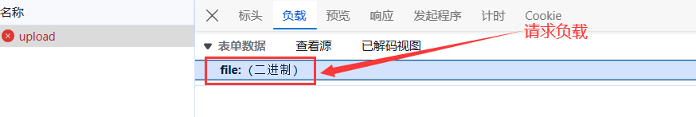
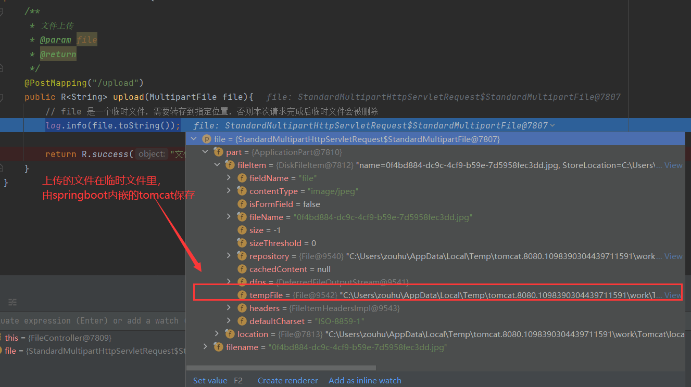
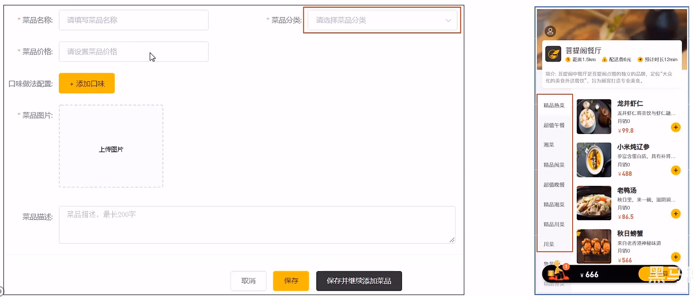
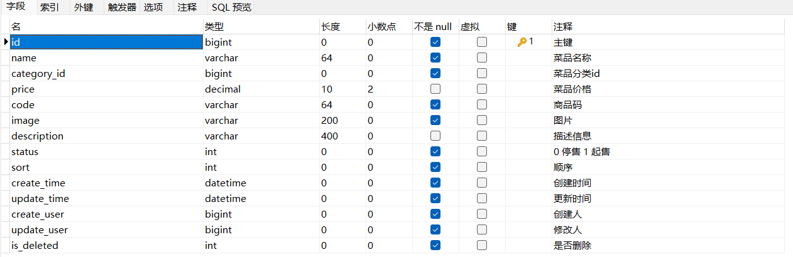
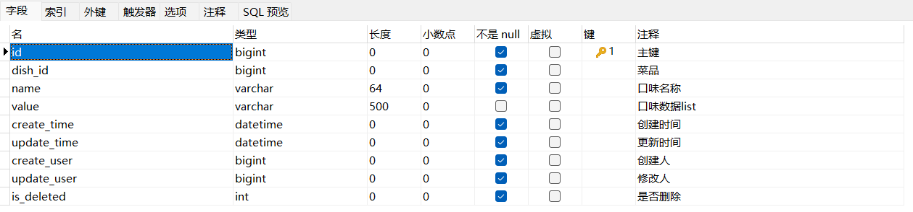
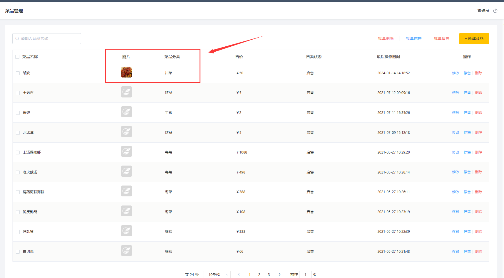

> 本文档主要实现 菜品业务管理，包括文件上传下载， 菜品删除，菜品起售或者停售，菜品删除，以及批量处理操作


# 一、文件上传下载

## 1.1 文件上传介绍

文件上传，也称为upload，是指将本地图片、视频、音频等文件上传到服务器上，可以供其他用户浏览或下载的过程文件上传在项目中应用非常广泛，我们经常发微博、发微信朋友圈都用到了文件上传功能。

（1） 前端代码

文件上传时，对页面的form表单有如下要求:

- method="post"                                                采用post方式提交数据

- enctype="multipart/form-data"                   采用multipart格式上传文件

- type="file"                                                       使用input的file控件上传

  

  举个例子，

```html
<form method="post" action="/common/upload" enctype="multipart/form-data"><input name="myFile" type="file" />
<input type="submit" value="提交" /></form>
```

目前一些前端组件库也提供了相应的上传组件，但是底层原理还是基于form表单的文件上传。例如ElementUI中提供的upload上传组件。

（2）后端代码

服务端要接收客户端页面上传的文件，通常都会使用Apache的两个组件:

- commons-fileupload

- commons-io

Spring框架在spring-web包中对文件上传进行了封装，大大简化了服务端代码，我们只需要在Controller的方法中声明一个MultipartFile类型的参数即可接收上传的文件。


## 1.2 前端代码分析

**（1） 上传代码**

在 `src/main/resources/backend/page/demo/upload.html`， 

```html
<div class="container">
        <el-upload class="avatar-uploader"
                action="/file/upload"
                :show-file-list="false"
                :on-success="handleAvatarSuccess"
                :before-upload="beforeUpload"
                ref="upload">
            </img>
            <i v-else class="el-icon-plus avatar-uploader-icon"></i>
        </el-upload>
    </div>
```

其中，`action="/file/upload"` 表示请求URL路径（例如 http://localhost:63342/file/upload）。请求负载里面的参数是 file



**（2）下载代码**

文件下载，页面段可以使用 `` 标签展示下载的图片

```html
 </img>
```

`imageUrl` ： 页面上的模型数据

当图片上传完后，会调用 handleAvatarSuccess() 方法，给imageUrl 赋值。前端页面继而向服务端提交请求 `/file/download?name=${response.data}`

```
handleAvatarSuccess (response, file, fileList) {
    this.imageUrl = `/file/download?name=${response.data}`
}
```

## 1.2 文件下载介绍

文件下载，也称为download，是指将文件从服务器传输到本地计算机的过程。

通过浏览器进行文件下载，通常有两种表现形式:

- 以附件形式下载，弹出保存对话框，将文件保存到指定磁盘目录
- 直接在浏览器中打开

通过浏览器进行文件下载，**本质上就是服务端将文件以流的形式写回浏览器的过程**。


## 1.3 文件上传代码实现

在上传前，我们先明确一点：**上传的 `file` 是一个临时文件**，需要转存到指定位置，否则本次请求完成后临时文件会被删除




在 `src/main/resources/application.yml` 里面添加 `reggie.path` ，用于动态设置文件上传的路径

```
reggie:
  path: D:\
```

在 `src/main/java/com/idealzouhu/reggie/controller/FileController.java` 里面 ， 添加代码

```java
@Slf4j
@RestController
@RequestMapping("/file")
public class FileController {

    @Value("${reggie.path}")  // 获取 application.yml 里面的 reggie.path
    private String basePath;

    /**
     * 文件上传
     * @param file
     * @return
     */
    @PostMapping("/upload")
    public R<String> upload(MultipartFile file){
        // file 是一个临时文件，需要转存到指定位置，否则本次请求完成后临时文件会被删除
        // log.info(file.toString());

        // 获取原始文件名（例如 abc.jpg）
        String originalFilename = file.getOriginalFilename();
        String suffix = originalFilename.substring(originalFilename.lastIndexOf("."));  // 得到文件后缀

        // 使用 UUID 重新生成文件名，防止文件名称重复造成文件覆盖
        String fileName = UUID.randomUUID().toString() + suffix;

        // 创建一个目录对象
        File dir = new File(basePath);
        if(!dir.exists()){
            dir.mkdirs();  // 如果目录不存在，需要创建
        }

        try {
            file.transferTo(new File(basePath + fileName));
        } catch (IOException e) {
            throw new RuntimeException(e);
        }

        // 需要注意的是，最后要返回文件名。因为在菜品上传的时候，需要上传的文件的名字；前端要下载文件的时候，也需要这个文件名
        return R.success(fileName);
    }
}
```


## 1.4 文件下载代码实现

在 `src/main/java/com/idealzouhu/reggie/controller/FileController.java` 里面 ， 添加代码

```java
 /**
     * 文件下载
     * @param name
     * @param response
     */
    @GetMapping("/download")
    public void download(String name, HttpServletResponse response){

        try {
            // 输入流，通过输入读取文件内容
            FileInputStream fileInputStream = new FileInputStream(basePath + name);

            // 输出流，通过输出流将文件写回浏览器，在浏览器展示图片
            ServletOutputStream outputStream = response.getOutputStream();

            response.setContentType("image/jpeg");

            int len = 0;
            byte[] bytes = new byte[1024];
            while ((len = fileInputStream.read(bytes)) != -1){
                outputStream.write(bytes, 0, len);
                outputStream.flush();
            }

            // 关闭资源
            outputStream.close();
            fileInputStream.close();

        } catch (FileNotFoundException e) {
            throw new RuntimeException(e);
        } catch (IOException e) {
            throw new RuntimeException(e);
        }


    }
```


# 二、新增菜品

## 2.1 需求分析

后台系统中可以管理菜品信息，可以新增菜品

在添加菜品时，需要选择当前菜品所属的菜品分类，并且上传菜品图片。移动端会按照菜品分类来展示菜品信息




## 2.2 数据模型

新增分类，实际上是将数据插入到 `dish` 表里面。其中，image 存放菜品图片名称，是后面的图片下载所需的参数，用于展示菜品名称。



如果选择了口味做法配置（例如忌口、辣度、温度等），还要将口味配置的数据插入到 `dish_flavor`。




## 2.3 前端代码分析

（1）add.html

 `backend/page/food/add.html` 为添加菜品的页面。

```
created() {
          this.getDishList()
          // 口味临时数据
          this.getFlavorListHand()
          this.id = requestUrlParam('id')
          this.actionType = this.id ? 'edit' : 'add'
          if (this.id) {
            this.init()
          }
        }
        
        
 			// 获取菜品分类
          getDishList () {
            getCategoryList({ 'type': 1 }).then(res => {
              if (res.code === 1) {
                this.dishList = res.data
              } else {
                this.$message.error(res.msg || '操作失败')
              }
            })
          },

          // 获取口味列表
          getFlavorListHand () {
            // flavor flavorData
            this.dishFlavorsData = [
              {'name':'甜味','value':['无糖','少糖','半糖','多糖','全糖']},
              {'name':'温度','value':['热饮','常温','去冰','少冰','多冰']},
              {'name':'忌口','value':['不要葱','不要蒜','不要香菜','不要辣']},
              {'name':'辣度','value':['不辣','微辣','中辣','重辣']}
            ]
          }
```

每次add.html 会自动执行 created() 方法， 进而自动调用 `getDishList`  和 `getFlavorListHand`。 其中：

- `getDishList`  ： 自动查询菜品分类
- `getFlavorListHand`： 自动查询口味列表


```
 <el-upload
              class="avatar-uploader"
              action="/file/upload"
              :show-file-list="false"
              :on-success="handleAvatarSuccess"
              :on-change="onChange"
              ref="upload"
            >
              </img>
              <i
                v-else
                class="el-icon-plus avatar-uploader-icon"
              ></i>
            </el-upload>
            
.................
handleAvatarSuccess (response, file, fileList) {
            // 拼接down接口预览
            if(response.code === 0 && response.msg === '未登录'){
              window.top.location.href = '/backend/page/login/login.html'
            }else{
              this.imageUrl = `/file/download?name=${response.data}`
              this.ruleForm.image = response.data
            }
          }
```

当上传图片时，会伴随着图片下载的路径

  `action="/file/upload"`  ： 图片上传的 URL 请求

`:on-success="handleAvatarSuccess"`： 当图片上传成功后，客户端接受到响应（带有处理成功的图片文件名的参数 name）。客户端随着调用 handleAvatarSuccess 方法，进而发出图片下载的请求


```
 if (this.actionType == 'add') {
                  delete params.id
                  addDish(params).then(res => {
                    if (res.code === 1) {
                      this.$message.success('菜品添加成功！')
                      if (!st) {
                        this.goBack()
                      } else {
                        this.dishFlavors = []
                        // this.dishFlavorsData = []
                        this.imageUrl = ''
                        this.ruleForm = {
                          'name': '',
                          'id': '',
                          'price': '',
                          'code': '',
                          'image': '',
                          'description': '',
                          'dishFlavors': [],
                          'status': true,
                          categoryId: ''
                        }
                      }
                    } else {
                      this.$message.error(res.msg || '操作失败')
                    }
                  }).catch(err => {
                    this.$message.error('请求出错了：' + err)
                  })
                } 
```

当点击 提交按钮后， 调用  addDish(params) ， 发送URL 请求

（2）food.js

在 `backend/api/food.js`里面

```
// 获取菜品分类列表
const getCategoryList = (params) => {
  return $axios({
    url: '/category/list',
    method: 'get',
    params
  })
}

// 新增接口
const addDish = (params) => {
  return $axios({
    url: '/dish/addDish',
    method: 'post',
    data: { ...params }
  })
}
```


## 2.4 代码开发

在开发代码之前，需要梳理一下整个程序的执行过程:

1. 页面( backend/page/food/add.html ) 发送ajax请求，请求服务端**获取菜品分类数据**展示到下拉框中
2. 页面发送请求进行图片上传，请求服务端**将图片保存到服务器**
3. 页面发送请求进行图片下载，**将上传的图片进行回显**
4. 点击保存按钮，发送ajax请求，**将菜品相关数据以json形式提交到服务端**

开发新增菜品功能，其实就是在服务端编写代码去处理前端页面发送的这4次请求即可。

**(1) 导入 DTO**

由于点击保存按钮后，**返回的 json 数据包括 Dish、DishFlavor 两个实体的数据，我们难以用参数解析这个 json 数据**

因此，我们 需要创建 DishDto。

> DTO，全称为Data Transfer Object，即数据传输对象，一般用于展示层与服务层之间的数据传输。

创建 `src/main/java/com/idealzouhu/reggie/dto/DishDto.java`， 具体代码为

```
@Data
public class DishDto extends Dish {

    private List<DishFlavor> flavors = new ArrayList<>();

    private String categoryName;

    private Integer copies;
}
```

在 `src/main/java/com/idealzouhu/reggie/service/impl/DishServiceImpl.java` 添加新的方法，具体代码为

```java
/**
     * 新增菜品，同时保存对应的口味数据
     * @param dishdto
     */
    @Transactional
    @Override
    public void saveWithFlavor(DishDto dishdto) {
        // 保存菜品信息
        this.save(dishdto);  // 为什么这个实体还包括了其他信息，却不会报错

        // 保存菜品口味信息
        Long dishId = dishdto.getId();
        List<DishFlavor> dishFlavorList = dishdto.getFlavors();
        dishFlavorList.stream().map((item)->{
            item.setDishId(dishId);
            return item;
        }).collect(Collectors.toList());
        dishFlavorService.saveBatch(dishFlavorList);

    }
```

注意，该方法上面要加上注解 @Transactional 。 同时，springboot 启动类也要加上 @EnableTransactionManagement


最后，在 `src/main/java/com/idealzouhu/reggie/controller/DishController.java`里面添加以下代码

```java
	/**
     * 新增菜品
     * @param dishDto
     * @return
     */
    @PostMapping("/addDish")
    public R<String> addDish(@RequestBody DishDto dishDto){
        log.info(dishDto.toString());
        dishService.saveWithFlavor(dishDto);
        return R.success("新增菜品成功");
    }
```


# 三、分页查询

## 3.1 需求分页

在菜品信息分页查询里面，图片 和 菜品分类 的信息显示相对麻烦一点。

Dish 表里面只有 Dish_id, 并没有菜品分类的名称。



## 3.1 前端代码

（1）list.html

在 `backend/page/food/list.html` 里面

```
created() {
          this.init()
        }
        
.............
async init () {
            const params = {
              page: this.page,
              pageSize: this.pageSize,
              name: this.input ? this.input : undefined
            }
            await getDishPage(params).then(res => {
              if (String(res.code) === '1') {
                this.tableData = res.data.records || []
                this.counts = res.data.total
              }
            }).catch(err => {
              this.$message.error('请求出错了：' + err)
            })
          }
```

每次add.html 会自动执行 created() 方法， 进而自动调用 `init`， 更进一步调用 `getDishPage` 方法，发送 ajax 请求


```
<el-table-column
    prop="categoryName"
    label="菜品分类"
></el-table-column>
```

当 浏览器接收的 json 字段里面有 `categoryName`， 将会页面上展示这个字段。该字段表示 菜品分类


```
  <el-table-column prop="image" label="图片" align="center">
          <template slot-scope="{ row }">
            <el-image style="width: auto; height: 40px; border:none;cursor: pointer;" 
            :src="getImage(row.image)" 
            :preview-src-list="[ `/file/download?name=${row.image}` ]" >
            <div slot="error" class="image-slot">
              
            </div>  
          </el-image>
          </template>
        </el-table-column>
        
        getImage (image) {
            return `/file/download?name=${image}`
          }
```

 `:preview-src-list="[ /file/download?name=${row.image} ]"`:  图片下载的 URL


（2）food.js

在 `backend/api/food.js`里面

```
// 查询列表接口
const getDishPage = (params) => {
  return $axios({
    url: '/dish/page',
    method: 'get',
    params
  })
}
```


## 3.2 代码开发

在开发代码之前，需要梳理一下整个程序的执行过程:

1. 页面 `backend/page/food/list.html` 发送 ajax 请求，将分页查询参数( page、pageSize、name )提交到服务端， 获取分页数据。在查询到菜品数据后，页面还会发送一次 ajax 请求服务端进行图片下载的请求，用于页面图片展示。
2. 页面接收到分页数据并通过ElementUI的Table组件展示到页面上

实际上，开发菜品信息分页查询功能， 就是服务端处理前端页面发送的两次 ajax 请求。

在 `src/main/java/com/idealzouhu/reggie/controller/CategoryController.java`里，添加以下代码

```
  /**
     * 分页查询
     * @param page
     * @param pageSize
     * @return
     */
    @GetMapping("/page")
    public R<Page> page(int page, int pageSize){
        log.info("page = {}, pageSize = {}", page, pageSize);

        // 1. 构造分页查询器
        Page<Category> pageInfo = new Page<>(page, pageSize);

        // 2. 构造条件构造器
        LambdaQueryWrapper<Category> lambdaQueryWrapper = new LambdaQueryWrapper();
        lambdaQueryWrapper.orderByAsc(Category::getSort);  // 添加排序条件

        // 3.执行查询
        categoryService.page(pageInfo, lambdaQueryWrapper);

        return R.success(pageInfo);
    }
```


# 四、修改菜品

## 5.1 需求分析

在分类管理窗口， 点击修改按钮，弹出修改窗口


## 5.2 前端代码分析

(1) add.html

在 `backend/page/food/add.html` 里面,  本部分代码的解析查看 新增菜品的[前端代码解析](./## 2.3 前端代码分析) 

```
 async init () {
            queryDishById(this.id).then(res => {
              console.log(res)
              if (String(res.code) === '1') {
                this.ruleForm = { ...res.data }
                this.ruleForm.price = String(res.data.price/100)
                this.ruleForm.status = res.data.status == '1'
                this.dishFlavors = res.data.flavors && res.data.flavors.map(obj => ({ ...obj, value: JSON.parse(obj.value),showOption: false }))
                console.log('this.dishFlavors',this.dishFlavors)
                // this.ruleForm.id = res.data.data.categoryId
                // this.imageUrl = res.data.data.image
                this.imageUrl = `/file/download?name=${res.data.image}`
              } else {
                this.$message.error(res.msg || '操作失败')
              }
            })
          }
```

`this.imageUrl = /file/download?name=${res.data.image}`： 添加页面的 图片下载的请求


（2）category.js

在 `src/main/resources/backend/api/category.js`里面

```java
// 查询详情
const queryDishById = (id) => {
  return $axios({
    url: `/dish/${id}`,
    method: 'get'
  })
}

// 修改接口
const editDish = (params) => {
  return $axios({
    url: '/dish/editDish',
    method: 'put',
    data: { ...params }
  })
}
```


## 5.3 代码开发

在开发代码之前，需要梳理一下修改菜品时前端页面（`backend/page/food/add.html`)和服务端的交互过程:

1. 页面发送 ajax 请求，请求服务端获取分类数据，用于菜品分类下拉框中数据展示

2. 页面发送 ajax 请求，请求服务端，**根据 id 查询当前菜品信息**，用于菜品信息回显

3. 页面发送请求，请求服务端进行图片下载，用于页面图片回显

4. 点击保存按钮，页面发送ajax请求，**将修改后的菜品相关数据以json形式提交到服务端**


开发修改菜品功能，其实就是在服务端编写代码去处理前端页面发送的这4次请求即可。其中，第1步和第3步的请求，新增菜品的功能实现里面已经完成了。


在 `src/main/java/com/idealzouhu/reggie/service/DishService.java`里，添加代码

```java
	/**
     * 根据id 查询 菜品和菜品口味信息
     * @param id
     * @return
     */
    @Override
    public DishDto getByIdWithFlavor(Long id) {
        // 查询菜品基本信息，从 dish表查询
        Dish dish = this.getById(id);

        // 查询当前菜品对应的口味信息，从 dish_flavor 表查询
        LambdaQueryWrapper<DishFlavor> lambdaQueryWrapper = new LambdaQueryWrapper<>();
        lambdaQueryWrapper.eq(DishFlavor::getDishId, dish.getId());
        List<DishFlavor> dishFlavorList = dishFlavorService.list(lambdaQueryWrapper);

        // 将查询信息合并成 DishDto
        DishDto dishDto = new DishDto();
        BeanUtils.copyProperties(dish, dishDto);
        dishDto.setFlavors(dishFlavorList);

        return dishDto;
    }

    @Override
    @Transactional
    public void updateWithFlavor(DishDto dishDto) {
        // 更新 dish表 基本信息
        this.updateById(dishDto);

        // 清理 dish_flavor表 信息 —— delete
        LambdaQueryWrapper<DishFlavor> lambdaQueryWrapper = new LambdaQueryWrapper<>();
        lambdaQueryWrapper.eq(DishFlavor::getDishId, dishDto.getId());
        dishFlavorService.remove(lambdaQueryWrapper);

        // 添加当前提交过来的菜品口味数据 —— insert
        Long dishId = dishDto.getId();
        List<DishFlavor> dishFlavorList = dishDto.getFlavors();
        dishFlavorList.stream().map((item)->{
            item.setDishId(dishId);
            return item;
        }).collect(Collectors.toList());
        dishFlavorService.saveBatch(dishFlavorList);

    }
```


在 `src/main/java/com/idealzouhu/reggie/controller/DishController.java`里，添加以下代码

```java
	/**
     * 修改菜品
     * @param dishDto
     * @return
     */
    @PutMapping("/editDish")
    public R<String> editDish(@RequestBody DishDto dishDto){
        log.info(dishDto.toString());
        dishService.updateWithFlavor(dishDto);
        return R.success("新增菜品成功");
    }

    /**
     * 根据 id 查看菜品信息
     * @param id
     * @return
     */
    @GetMapping("/{id}")
    public R<DishDto> queryDishById(@PathVariable Long id){
        DishDto dishDto = dishService.getByIdWithFlavor(id);
        return R.success(dishDto);
    }


```

