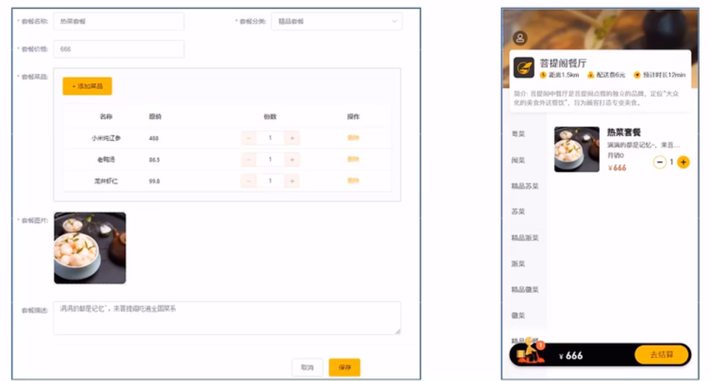
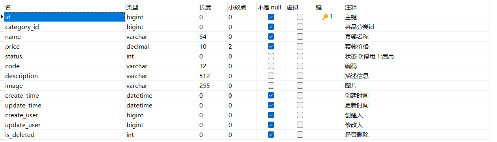
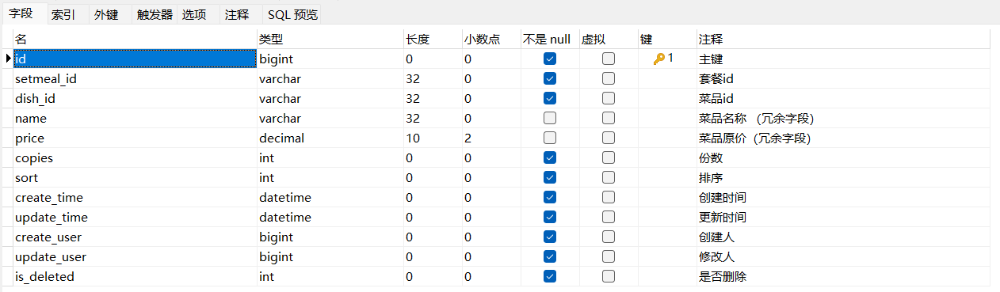
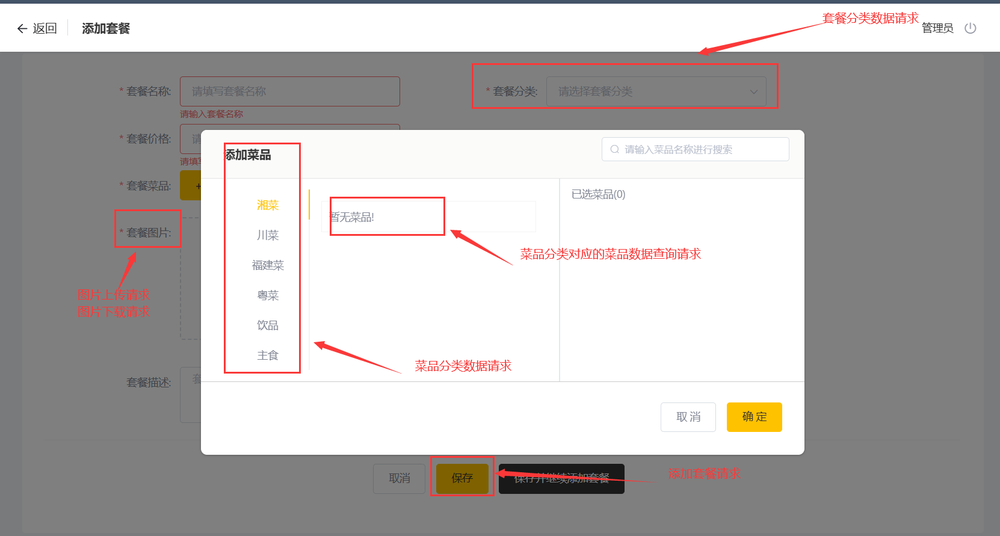
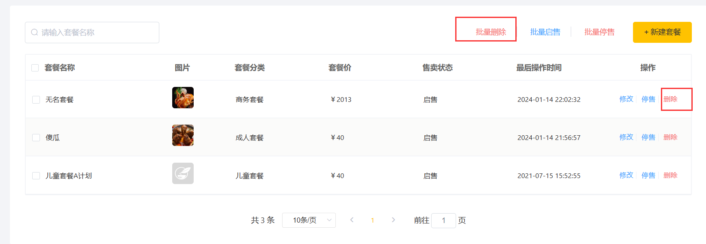

> 本文档主要实现 套餐业务管理，包括 新增套餐、套餐信息分页查询、删除套餐


# 一、新增套餐

## 1.1 需求分析

套餐就是菜品的集合。
后台系统中可以管理套餐信息，通过新增套餐功能来添加一个新的套餐，在添加套餐时需要**选择当前套餐所属的套餐分类和包含的菜品，并且需要上传套餐对应的图片**，在移动端会按照套餐分类来展示对应的套餐。




## 1.2 数据模型

新增套餐，其实就是将新增页面录入的套餐信息插入到setmeal表，还需要向setmeal_dish表插入套餐和菜品关联数据。所以在新增套餐时，涉及到两个表:

- setmeal              套餐表 
- setmeal_dish     套餐菜品关系表


## 1.3 前端代码分析

**(1) add.html**

`backend/page/combo/add.html`  为 新增套餐的页面。

其中，getCategoryList 发送**获取套餐分类数据**请求

```
 // 获取套餐分类
          getDishTypeList() {
            getCategoryList({ type: 2, page: 1, pageSize: 1000 }).then((res) => {
              if (res.code === 1) {
                this.setMealList = res.data.map((obj) => ({ ...obj, idType: obj.id }))
              } else {
                this.$message.error(res.msg || '操作失败')
              }
            })
          }
```


当上传图片时，会伴随着图片下载的请求。

  `action="/file/upload"`  ： 图片上传的 URL 请求

`:on-success="handleAvatarSuccess"`： 当图片上传成功后，客户端接受到响应（带有处理成功的图片文件名的参数 name）。客户端随着调用 handleAvatarSuccess 方法，进而发出图片下载的请求

```
  <el-form-item label="套餐图片:" class="uploadImg">
              <el-upload
                class="avatar-uploader"
                action="/file/upload"
                :show-file-list="false"
                :on-success="handleAvatarSuccess"
                :on-change="onChange"
                ref="upload"
              >
                </img>
                <i v-else class="el-icon-plus avatar-uploader-icon"></i>
              </el-upload>
            </el-form-item>
 ................
            handleAvatarSuccess (response, file, fileList) {
            // this.imageUrl = response.data
            if(response.code === 0 && response.msg === '未登录'){
              window.top.location.href = '/backend/page/login/login.html'
            }else{
              this.imageUrl = `/file/download?name=${response.data}`
              this.ruleForm.image = response.data
            }
          }
```


发出添加套餐请求的方法为 addSetmeal

```
 if (this.actionType == 'add') {
                  delete prams.id
                  addSetmeal(prams)
```


## 1.4 代码开发

在开发代码之前，需要梳理一下新增套餐时前端页面 `backend/page/combo/add.html` 和服务端的交互过程:

1. 页面发送ajax请求，请求服务端 **获取套餐分类数据** 并展示到下拉框中  (例如  `http://localhost:8080/category/list?type=2&page=1&pageSize=1000` )
2. 页面发送ajax请求，请求服务端 **获取菜品分类数据** 并展示到添加菜品窗口中  （例如 `http://localhost:8080/category/list?type=1`）
3. 页面发送ajax请求，请求服务端，**根据菜品分类查询对应的菜品数据** 并展示到添加菜品窗口中 例如 `http://localhost:8080/dish/list?categoryId=1746174481149222914`）
4. 页面发送请求进行图片上传，请求服务端将图片保存到服务器
5. 页面发送请求进行图片下载，将上传的图片进行回显
6. 点击保存按钮，发送ajax请求，**将套餐相关数据以json形式提交到服务端**  （例如 `http://localhost:8080/setmeal`， POST方法）



开发新增套餐功能，其实就是在服务端编写代码去处理前端页面发送的这6次请求即可。


在 `src/main/java/com/idealzouhu/reggie/controller/DishController.java`里，实现**根据菜品分类查询对应的菜品数据** ，添加以下代码

```
	/**
     * 根据条件查询对应的菜品数据
     * @param dish
     * @return
     */
    @GetMapping("/list")
    public R<List<Dish>> list(Dish dish){

        // 根据菜品分类 CategoryId 查询符合的菜品数据集合
        LambdaQueryWrapper<Dish> lambdaQueryWrapper = new LambdaQueryWrapper<>();
        lambdaQueryWrapper.eq(dish.getCategoryId() != null, Dish::getCategoryId, dish.getCategoryId());
        lambdaQueryWrapper.eq(Dish::getStatus, 1);  // 只显示启售状态的菜品
        lambdaQueryWrapper.orderByAsc(Dish::getSort).orderByAsc(Dish::getUpdateTime);
        List<Dish> list = dishService.list(lambdaQueryWrapper);

        return R.success(list);
    }
```


在 `src/main/java/com/idealzouhu/reggie/service/impl/SetmealServiceImpl.java`里，实现**将套餐相关数据以json形式提交到服务端**，   添加代码

```java
	/**
     * 新增套餐，并保存套餐和菜品的关联关系
     * @param setmealDto
     */
    @Override
    @Transactional
    public void savewithDish(SetmealDto setmealDto) {
        // 保存套餐信息
        this.save(setmealDto);  // 为什么这个实体还包括了其他信息，却不会报错

        // 保存套餐和菜品的关联信息， 操作 set_meal表，执行 insert 操作
        Long setmealDtoId = setmealDto.getId();
        List<SetmealDish> setmealDishList = setmealDto.getSetmealDishes();
        setmealDishList.stream().map((item)->{
            item.setSetmealId(setmealDtoId);
            return item;
        }).collect(Collectors.toList());
        setmealDishService.saveBatch(setmealDishList);

    }
```

在 `src/main/java/com/idealzouhu/reggie/controller/SetmealController.java`里，添加代码

```
	/**
     * 新增套餐， 并向 setmeal_dish表 里面新增数据
     */
    @PostMapping
    public R<String> addSetmeal(@RequestBody SetmealDto setmealDto){
        setmealService.savewithDish(setmealDto);
        return R.success("新增套餐成功");
    }
```


# 二、分页查询

## 2.1 需求分析

简单地分页即可, **图片** 和 **菜品分类** 的信息显示相对麻烦一点。


## 3.1 前端代码

（1）list.html

在 `backend/page/food/list.html` 里面

```
created() {
          this.init()
        }
        
.............
async init () {
            const params = {
              page: this.page,
              pageSize: this.pageSize,
              name: this.input ? this.input : undefined
            }
            await getSetmealPage(params).then(res => {
              if (String(res.code) === '1') {
                this.tableData = res.data.records || []
                this.counts = res.data.total
              }
            }).catch(err => {
              this.$message.error('请求出错了：' + err)
            })
          }
```

每次 list.html 会自动执行 created() 方法， 进而自动调用 `init`， 更进一步调用 `getSetmealPage` 方法，发送 ajax 请求


```
  <el-table-column
      prop="categoryName"
      label="套餐分类"
  ></el-table-column>
```

当 浏览器接收的 json 字段里面有 `categoryName`， 将会页面上展示这个字段。该字段表示 套餐分类


```
<el-table-column prop="image" label="图片"  align="center">
          <template slot-scope="{ row }">
            <el-image style="width: auto; height: 40px; border:none;cursor: pointer;" :src="getImage(row.image)" :preview-src-list="[ `/file/download?name=${row.image}` ]" >
              <div slot="error" class="image-slot">
                
              </div> 
            </el-image>
          </template>
        </el-table-column>
        
        getImage (image) {
            return `/file/download?name=${image}`
          }
```

 `:preview-src-list="[ /file/download?name=${row.image} ]"`:  图片下载的 URL


（2）combo.js

在 `backend/api/combo.js`里面

```
// 查询列表数据
const getSetmealPage = (params) => {
  return $axios({
    url: '/setmeal/page',
    method: 'get',
    params
  })
}
```


## 3.2 代码开发

在开发代码之前，需要梳理一下整个程序的执行过程:

1. 页面 `backend/page/combo/list.html` 发送 ajax 请求，将分页查询参数( page、pageSize、name )提交到服务端， 获取分页数据。在查询到套餐数据后，页面还会发送一次 ajax 请求服务端进行图片下载的请求，用于页面图片展示。
2. 页面接收到分页数据并通过ElementUI的Table组件展示到页面上

实际上，开发菜品信息分页查询功能， 就是服务端处理前端页面发送的2次 ajax 请求。

在 `src/main/java/com/idealzouhu/reggie/controller/SetmealController.java`里，添加以下代码

```
  /**
     * 分页查询
     * @param page
     * @param pageSize
     * @return
     */
    @GetMapping("/page")
    public R<Page> page(int page, int pageSize){
        log.info("page = {}, pageSize = {}", page, pageSize);

        // 1. 构造分页查询器
        Page<Category> pageInfo = new Page<>(page, pageSize);

        // 2. 构造条件构造器
        LambdaQueryWrapper<Category> lambdaQueryWrapper = new LambdaQueryWrapper();
        lambdaQueryWrapper.orderByAsc(Category::getSort);  // 添加排序条件

        // 3.执行查询
        categoryService.page(pageInfo, lambdaQueryWrapper);

        return R.success(pageInfo);
    }
```


# 三、删除分类

## 4.1 需求分析

在分类管理列表页面，可以对某个套餐进行删除操作，也可以通过复选框批量删除套餐。

注意，对于状态为售卖中的套餐不能删除，需要先停售，然后才能删除。




## 4.2 前端代码

（1）list.html

在 `backend/page/combo/list.html` 里面， 这里无论是 删除单个套餐 或者 删除多个套餐，都会调用 deleteHandle 方法

```
<el-button
              type="text"
              size="small"
              class="delBut non"
              @click="deleteHandle('单删', scope.row.id)"
            >
              删除
            </el-button>
............
 // 删除
          deleteHandle (type, id) {
            if (type === '批量' && id === null) {
              if (this.checkList.length === 0) {
                return this.$message.error('请选择删除对象')
              }
            }
            this.$confirm('确定删除该套餐, 是否继续?', '确定删除', {
              'confirmButtonText': '确定',
              'cancelButtonText': '取消',
            }).then(() => {
              deleteSetmeal(type === '批量' ? this.checkList.join(',') : id).then(res => {
                if (res.code === 1) {
                  this.$message.success('删除成功！')
                  this.handleQuery()
                } else {
                  this.$message.error(res.msg || '操作失败')
                }
              }).catch(err => {
                this.$message.error('请求出错了：' + err)
              })
            })
          }
```


（2）combo.js

在 `backend/api/combo.js`里面

```
// 删除数据接口
const deleteSetmeal = (ids) => {
  return $axios({
    url: '/setmeal',
    method: 'delete',
    params: { ids }
  })
}
```

需要注意，这里的参数是 ids。

因为，在批量操作时，会有多个 id


## 4.3 代码开发

在开发代码之前，需要梳理一下整个程序的执行过程:

- 删除单个套餐时，页面发送 ajax请求，根据套餐 id 删除对应套餐

  ```
  请求 URL:
  http://localhost:8080/setmeal?ids=1746533256116830210
  请求方法:
  DELETE
  ```

- 删除多个套餐时，页面发送 ajax请求，根据提交的多个套餐 id 删除对应套餐

  ```
  请求 URL:
  http://localhost:8080/setmeal?ids=1746533256116830210,1746531852954370049
  请求方法:
  DELETE
  ```

  

观察删除单个套餐和批量删除套餐的请求信息可以发现，两种请求的地址和请求方式都是相同的，不同的则是传递的id个数，所以**在服务端可以提供一个方法来统一处理**。


在 `src/main/java/com/idealzouhu/reggie/service/impl/SetmealServiceImpl.java`， 创建 removeWithDish 方法

```java
 /**
     * 删除套餐，同时需要删除套餐和菜品的关联数据
     * @param ids
     */
    @Override
    public void removeWithDish(List<Long> ids) {
        // 查询套餐状态，查看是否删除。如果不能删除，抛出一个业务异常
        LambdaQueryWrapper<Setmeal> setmealLambdaQueryWrapper = new LambdaQueryWrapper<>();
        setmealLambdaQueryWrapper.in(Setmeal::getId, ids);
        setmealLambdaQueryWrapper.eq(Setmeal::getStatus, 1);
        int count = this.count(setmealLambdaQueryWrapper);
        if(count > 0){
            throw new CustomException("套餐正在售卖中，不能删除");
        }

        // 如果可以删除，先删除 setmeal表 中的数据
        this.removeByIds(ids);

        // 然后删除 setmeal_dish表 中的数据
        LambdaQueryWrapper<SetmealDish> setmealDishLambdaQueryWrapper = new LambdaQueryWrapper<>();
        setmealDishLambdaQueryWrapper.in(SetmealDish::getSetmealId, ids);
        setmealDishService.remove(setmealDishLambdaQueryWrapper);

    }
```

在 `src/main/java/com/idealzouhu/reggie/controller/SetmealController.java`里，添加以下代码

```java
	/**
     * 删除套餐 （单个 或者 批量）， 还要删除套餐与菜品的关联数据
     * @param ids
     * @return
     */
    @DeleteMapping
    public R<String> deleteSetmeal(@RequestParam List<Long> ids){
        setmealService.removeWithDish(ids);
        return R.success("成功删除套餐");
    }
```

