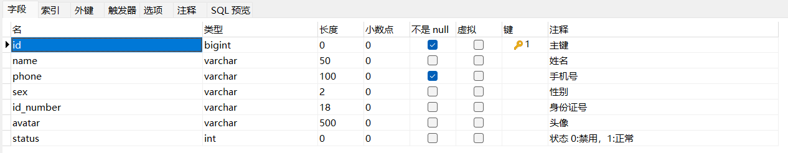

> 本文档主要实现短信发送和手机验证码登录


# 一、短信发送

## 1.1 短信服务介绍

目前市面上有很多第三方提供的短信服务，这些第三方短信服务会和各个运营商（移动、联通、电信）对接，我们只需要注册成为会员并且按照提供的开发文档进行调用就可以发送短信。需要说明的是，这些短信服务一般都是收费服务。

常用短信服务:

- 阿里云
- 华为云
- 腾讯云
- 京东
- 梦网
- 乐信

短信服务的应用场景：

- 验证码：用于用户身份认证，防止恶意注册，提高业务安全性。
- 短信通知： 支持各类业务场景的短信通知发送。
- 推广短信：支持全球多种场景的推广短信发送，提升企业品牌影响和助力业务发展。


## 1.2 阿里云短信服务开通

[短信服务_企业短信营销推广_验证码通知-阿里云 (aliyun.com) ](https://www.aliyun.com/product/sms?spm=5176.23667485.J_4VYgf18xNlTAyFFbOuOQe.180.2ec774fbf1LtE4&scm=20140722.S_product@@云产品@@80687._.ID_product@@云产品@@80687-RL_支持全球多种场景的推广短信发送，提升企业品牌影响和助力业务发展-LOC_menu~UND~product-OR_ser-V_3-P0_0)

这个可以免费使用 3个月


阿里云短信服务提供了两种发送短信的方式

- 通过API发送短信：有开发能力，将短信服务集成到自有系统，调用API接口发送短信
- 通过控制台发短信：零代码接入，在短信控制台上传需要发短信的手机号，自助发送


在这里，我们需要了解一些概念，完整的短信 = 短信签名 + 短信模板

- 短信签名：短信发送者的署名，表示发送方的身份。例如，在下面的短信中，【菜鸟裹裹】就是短信签名。

  ```
  【菜鸟裹裹】您好，您的快递已送达菜鸟驿站，取货码2763。感谢您的使用。
  ```

- 短信模板：包含场景发送内容、场景、变量信息。


我们可以使用 阿里云短信服务的新手教程。


我们要尽量创建 AccessKey


## 1.3 代码使用

我们并不需要自己手敲代码，官方已经提供了完整的案例。

> 官方案例教程查看 [短信服务_SDK中心-阿里云OpenAPI开发者门户 (aliyun.com)](https://next.api.aliyun.com/api-tools/sdk/Dysmsapi?version=2017-05-25&language=java-tea&tab=primer-doc)

具体开发步骤为：

- 导入 Maven 坐标
- 调用 API


# 二、手机验证码登录

## 2.1 需求分析

为了方便用户登录，移动端通常都会提供通过手机验证码登录的功能


## 2.2 数据模型

通过手机验证码登录时，涉及的表为 user 表，即用户表。结构如下：




## 2.3 前端代码

(1) login.html 

front/page/login.html 为 前端登录页面

注意，在访问后端代码时，需要切换设备

发送验证码前端代码

```
   getCode(){
                    this.form.code = ''
                    const regex = /^(13[0-9]{9})|(15[0-9]{9})|(17[0-9]{9})|(18[0-9]{9})|(19[0-9]{9})$/;
                    if (regex.test(this.form.phone)) {
                        this.msgFlag = false
                        // this.form.code = (Math.random()*1000000).toFixed(0)
                        sendMsgApi({phone:this.form.phone})
                    }else{
                        this.msgFlag = true
                    }
                }
```

`this.form.code = (Math.random()*1000000).toFixed(0)`： 用于自动填充 手机验证码，在表单中的"code"字段中生成一个随机的六位整数


登录验证码：

```
 async btnLogin(){
                    if(this.form.phone && this.form.code){
                        this.loading = true
                        const res = await loginApi(this.form)
                        // const res = await loginApi({phone:this.form.phone})
                        this.loading = false
                        if(res.code === 1){
                            sessionStorage.setItem("userPhone",this.form.phone)
                            window.requestAnimationFrame(()=>{
                                window.location.href= '/front/index.html'
                            })                           
                        }else{
                            this.$notify({ type:'warning', message:res.msg});
                        }
                    }else{
                        this.$notify({ type:'warning', message:'请输入手机号码'});
                    }
                }
```


（）

front/api/login.js

```
function loginApi(data) {
    return $axios({
      'url': '/user/login',
      'method': 'post',
      data
    })
  }

function loginoutApi() {
  return $axios({
    'url': '/user/loginout',
    'method': 'post',
  })
}

function sendMsgApi(data) {
    return $axios({
        'url': '/user/sendMsg',
        'method': 'post',
        data
    })
}

  
```


## 2.3 代码开发

在开发代码之前，需要梳理一下登录时前端页面和服务端的交互过程:

1. 在登录页面(`front/page/login.html`)输入手机号，点击【获取验证码】按钮，页面发送ajax请求，在服务端调用短信服务API给指定手机号发送验证码短信
2. 在登录页面输入验证码，点击【登录】按钮，发送ajax请求，在服务端处理登录请求

开发手机验证码登录功能，其实就是在服务端编写代码去处理前端页面发送的这2次请求即可。


(1) 修改过滤器

修改请求路径的过滤器

```
 String[] urls = new String[]{        // 定义不需要处理的请求路径;
                "/employee/login",
                "/employee/logout",
                "/backend/**",
                "/front/**",
                "/uesr/sendMsg",  // 移动端发送短信
                "/user/login"     // 移动端登录
        };
```

判断前端用户登录状态，如果已登录，则直接放行

```
 if(request.getSession().getAttribute("user") != null){
            // log.info("用户已登录，id为: {} ",request.getSession().getAttribute("user"));
            // log.info("线程id: {}" , Thread.currentThread().getId()) ;
            BaseContext.setCurrentId((Long) request.getSession().getAttribute("user"));  // 保存用户id到ThreadLocal里
            filterChain.doFilter(request, response);
            return;
        }
```


（2）

创建 `src/main/java/com/idealzouhu/reggie/controller/UserController.java`， 并添加以下代码

```java
  /**
     * 发送验证码
     * @param user
     * @param httpSession
     * @return
     */
    @PostMapping("/sendMsg")
    public R<String> sendMsg(@RequestBody User user, HttpSession httpSession){
        // 获取手机号
        String phone = user.getPhone();

        if(StringUtils.isNotEmpty(phone)){
            // 生成随机的4位验证码
            String code = ValidateCodeUtils.generateValidateCode(4).toString();
            log.info("code = {}",code);  // 后台输出验证码，可以用于取消短信服务后代码依然能够正常运行

            // 调用阿里云提供的短信服务API完成发送短信
            // SMSUtils.sendMessage("瑞吉外卖", "", phone,code);

            // 将生成的验证码保存到 session 里面
            httpSession.setAttribute(phone, code);

            return R.success("手机验证码发送成功");
        }

        return R.error("短信发送失败");
    }

    /**
     * 移动端用户登录
     * @param map
     * @param httpSession
     * @return
     */
    @PostMapping("/login")
    public R<User> login(@RequestBody Map map, HttpSession httpSession){
        log.info(map.toString());

        // 获取 手机号 和 验证码
        String phone = map.get("phone").toString();
        String code = map.get("code").toString();

        // 从 Session 中获取验证玛
        Object codeInsession = httpSession.getAttribute(phone);

        // 进行验证码对比，说明登录成功
        if(codeInsession != null && codeInsession.equals(code)){
            LambdaQueryWrapper<User> lambdaQueryWrapper = new LambdaQueryWrapper<>();
            lambdaQueryWrapper.eq(User::getPhone, phone);
            User user = userService.getOne(lambdaQueryWrapper);
            // 判断当前手机号对应的用户是否为新用户，如果是新用户，就自动注册
            if(user == null){
                user = new User();
                user.setPhone(phone);
                user.setStatus(1);
                userService.save(user);
            }
            httpSession.setAttribute("user", user.getId());
            return R.success(user);
        }

        return R.error("短信发送失败");
    }
```

