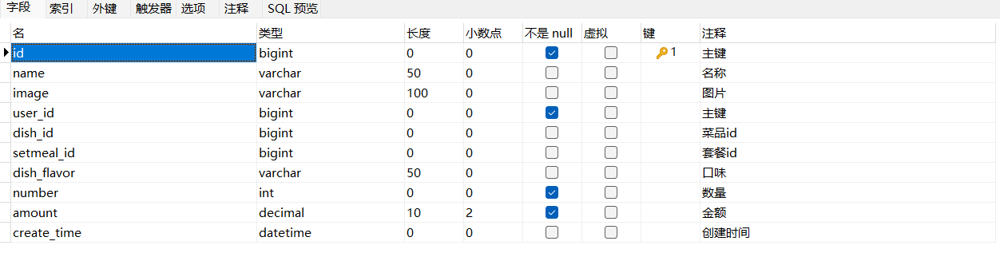

> 本文档主要实现用户地址簿相关功能


# 一、用户地址簿相关功能

## 1.1 需求分析

地址簿，指的是移动端消费者用户的地址信息，用户登录成功后可以维护自己的地址信息。同一个用户可以有多个地址信息，但是只能有一个默认地址。

用户可以添加、删除、修改地址，并选择默认地址。


## 1.2 数据模型

用户的地址信息会存储在 address_book 表


## 1.3 代码

创建 `src/main/java/com/idealzouhu/reggie/controller/AddressBookController.java`， 这部分代码，官方直接提供，但是存在一点问题


# 二、 菜品展示

## 2.1 需求分析

用户登录成功后跳转到系统首页，在首页需要根据分类来展示菜品和套餐。如果菜品设置了口味信息，需要展示 `选择规格` 按钮,否则显示  `+`  按钮。


## 2.2 数据模型


## 2.3 前端代码

（1）index.html

```
 //初始化数据
            initData(){
              Promise.all([categoryListApi(),cartListApi({})]).then(res=>{
                //获取分类数据
                if(res[0].code === 1){
                  this.categoryList = res[0].data
                  if(Array.isArray(res[0].data) && res[0].data.length > 0){
                    this.categoryId = res[0].data[0].id
                    if(res[0].data[0].type === 1){
                      this.getDishList()
                    }else{
                      this.getSetmealData()
                    }
                  }
                }else{
                  this.$notify({ type:'warning', message:res[0].msg});
                }
                //获取菜品数据
                if(res[1].code === 1){
                this.cartData = res[1].data
                }else{
                  this.$notify({ type:'warning', message:res[1].msg});
                }
              })
            },
```


```
//获取套餐数据setmealId
            async getSetmealData(){
              if(!this.categoryId){
                return
              }
              const res = await setmealListApi({categoryId:this.categoryId,status:1})
              if(res.code === 1){
                  let dishList = res.data
                  const cartData  = this.cartData
                  if(dishList.length > 0 && cartData.length > 0){
                    dishList.forEach(dish=>{
                      cartData.forEach(cart=>{
                        if(dish.id === cart.setmealId){
                          dish.number = cart.number
                        }
                      })
                    })
                  }
                  this.dishList = dishList
              }else{
                this.$notify({ type:'warning', message:res.msg});
              }
            },
```

(2)

`front/api/main.js`

```
//获取所有的菜品分类
function categoryListApi() {
    return $axios({
      'url': '/category/list',
      'method': 'get',
    })
  }
  
//获取购物车内商品的集合
function cartListApi(data) {
    return $axios({
        'url': '/shoppingCart/list',
        'method': 'get',
        params:{...data}
    })
}

//获取菜品分类对应的套餐
function setmealListApi(data) {
    return $axios({
        'url': '/setmeal/list',
        'method': 'get',
        params:{...data}
    })
}
```


## 2.4 代码开发

在开发代码之前，需要梳理一下前端页面和服务端的交互过程:

1. 页面(front/index.html)发送ajax请求，**获取分类数据**（菜品分类和套餐分类)

2. 页面发送ajax请求，**获取第一个分类下的菜品或者套餐**

开发菜品展示功能，其实就是在服务端编写代码去处理前端页面发送的这2次请求即可。

（1）停用 加载购物车数据

注意∶首页加载完成后，还发送了一次ajax请求用于**加载购物车数据**，此处可以将这次请求的地址暂时修改一下，从静态json文件获取数据，<font color = "red">**后续开发购物车功能时再修改回来**</font>等，如下:

```
//获取购物车内商品的集合
function cartListApi(data) {
    return $axios({
        // 'url': '/shoppingCart/list',
        'url':'/front/cartData.json'
        'method': 'get',
        params:{...data}
    })
}
```

`cartData.json` 的内容如下：

```
{"code":1,"msg":null,"data":[],"map":{}}
```

（2）重新创建一个新的菜品展示方法

页面发送ajax请求，**获取第一个分类下的菜品或者套餐**。

现在，有个问题，我们获取的不仅是分类下的菜品或者套餐，**还有口味信息**


（3）创建套餐分类里面的套餐列表信息

在 `src/main/java/com/idealzouhu/reggie/controller/SetmealController.java` 里添加以下代码

```
 @GetMapping("/list")
    public R<List<Setmeal>> list(Setmeal setmeal){
        LambdaQueryWrapper<Setmeal> lambdaQueryWrapper = new LambdaQueryWrapper<>();
        lambdaQueryWrapper.eq(setmeal.getId() != null, Setmeal::getCategoryId, setmeal.getCategoryId());
        lambdaQueryWrapper.eq(setmeal.getStatus() != null, Setmeal::getStatus, setmeal.getStatus());
        lambdaQueryWrapper.orderByDesc(Setmeal::getUpdateTime);
        List<Setmeal> list = setmealService.list(lambdaQueryWrapper);

        return R.success(list);

    }
```


# 三、购物车

## 3.1 需求分析

移动端用户可以将菜品或者套餐添加到购物车。

对于菜品来说，如果设置了口味信息，则需要选择规格后才能加入购物车;

对于套餐来说，可以直接点击将当前套餐加入购物车。

在购物车中可以修改菜品和套餐的数量，也可以清空购物车。


## 3.2 数据模型

购物车对应的表为 `shopping_car` 表，具体结构如下：




注意的是，购物车 里面添加的每个菜品或者每个套餐对应 `shopping_car` 表里面的一条数据。所以用户购物车实际上对应着  `shopping_car` 表里面的多条数据


## 3.3 前端代码


```
//获取购物车内商品的集合
function cartListApi(data) {
    return $axios({
        'url': '/shoppingCart/list',
        //'url':'/front/cartData.json',
        'method': 'get',
        params:{...data}
    })
}

//购物车中添加商品
function  addCartApi(data){
    return $axios({
        'url': '/shoppingCart/add',
        'method': 'post',
        data
      })
}

//购物车中修改商品
function  updateCartApi(data){
    return $axios({
        'url': '/shoppingCart/sub',
        'method': 'post',
        data
      })
}

//删除购物车的商品
function clearCartApi() {
    return $axios({
        'url': '/shoppingCart/clean',
        'method': 'delete',
    })
}

```


## 3.3 代码开发

在开发代码之前，需要梳理一下购物车操作时前端页面和服务端的交互过程:

1. 点击`加入购物车` 或者 `+` 按钮，页面发送 ajax 请求，请求服务端，将菜品或者套餐添加到购物车
2. 点击购物车图标，页面发送 ajax 请求，请求服务端查询购物车中的菜品和套餐
3. 点击清空购物车按钮，页面发送 ajax 请求，请求服务端来执行清空购物车操作

开发购物车功能，其实就是在服务端编写代码去处理前端页面发送的这3次请求即可。


### 3.3.1 添加购物车


### 3.3.2 展示购物车


### 3.3.3 清空购物车


# 四、用户下单

移动端用户将 菜品 或者 套餐 加入购物车后，可以点击购物车中的 `去结算` 按钮，页面跳转到订单确认页面，点击 `去支付` 按钮则完成下单操作。


## 4.2 数据模型

`orders` 订单表 


`order_detail` 表


## 4.3 前端代码


## 4.4 代码开发

在开发代码之前，需要梳理一下用户下单操作时前端页面和服务端的交互过程:

1. 在购物车中点击 `去结算` 按钮，页面跳转到订单确认页面
2. 在订单确认页面，发送ajax请求，请求服务端获取当前登录用户的默认地址
3. 在订单确认页面，发送ajax请求，请求服务端获取当前登录用户的购物车数据
4. 在订单确认页面点击 `去支付` 按钮，发送ajax请求，请求服务端完成下单操作

开发用户下单功能，其实就是在服务端编写代码去处理前端页面发送的这4次请求即可。其中，第二条 和 第三条请求已经实现。


### 4.4.1 支付功能实现


